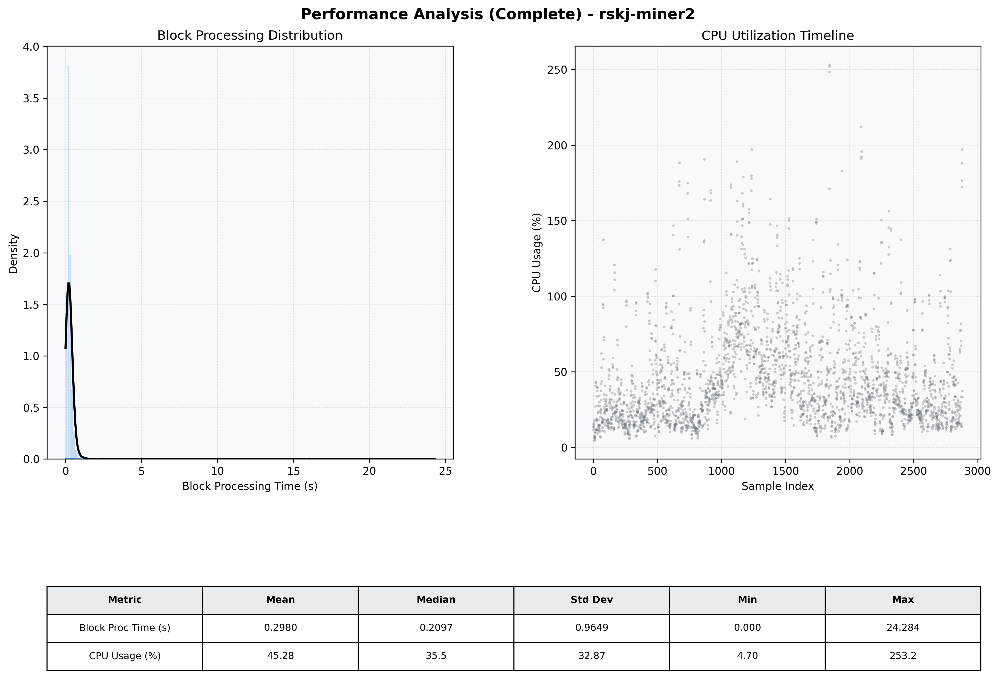

# Miner2 Quantitative Performance Report

| Category | Metric | Unit | Mean | Median | Min | Max |
| :--- | :--- | :--- | :--- | :--- | :--- | :--- |
| Processing | Block Processing Time | s | 0.298 | 0.210 | 0.000 | 24.284 |
|  | BlockExecution JMX | s | 0.205 | 0.114 | 0.002 | 24.136 |
| | Gas Consumed (per block) | M units | 22.01 | 24.66 | 0.00 | 24.79 |
| Resources | CPU Usage per Container | % | 45.28 | 35.46 | 4.70 | 253.19 |
|  | Memory Usage per Container | MiB | 3733.2 | 3917.0 | 1766.9 | 4096.0 |
| Disk I/O | Disk Read | MiB/s | 257.627 | 0.000 | 0.000 | 65492.568 |
|  | Disk Write | MiB/s | 394.750 | 4.828 | 0.000 | 73451.736 |
| Network | Received Network Traffic per Container | KiB/s | 2.70 | 2.10 | 0.56 | 10.89 |
|  | Sent Network Traffic per Container | KiB/s | 11.36 | 10.97 | 2.86 | 39.91 |

