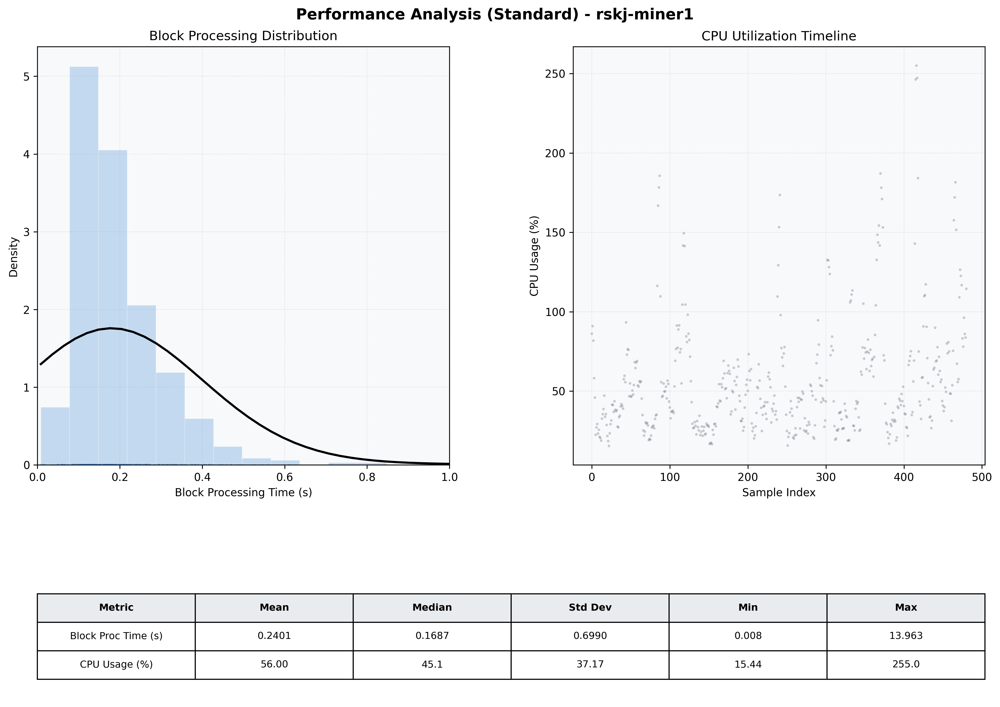

# Miner1 Quantitative Performance Report

| Category | Metric | Unit | Mean | Median | Min | Max |
| :--- | :--- | :--- | :--- | :--- | :--- | :--- |
| Processing | Block Processing Time | s | 0.240 | 0.169 | 0.008 | 13.963 |
|  | BlockExecution JMX | s | 0.116 | 0.092 | 0.004 | 0.807 |
| | Gas Consumed (per block) | M units | 22.58 | 24.67 | 0.00 | 24.79 |
| Resources | CPU Usage per Container | % | 56.00 | 45.10 | 15.44 | 255.02 |
|  | Memory Usage per Container | MiB | 3975.0 | 3972.0 | 3860.8 | 4096.0 |
| Disk I/O | Disk Read | MiB/s | 406.763 | 2.759 | 0.000 | 62273.301 |
|  | Disk Write | MiB/s | 628.168 | 49.517 | 0.000 | 70378.677 |
| Network | Received Network Traffic per Container | KiB/s | 22.02 | 11.83 | 1.54 | 70.46 |
|  | Sent Network Traffic per Container | KiB/s | 27.18 | 20.01 | 10.97 | 65.92 |

