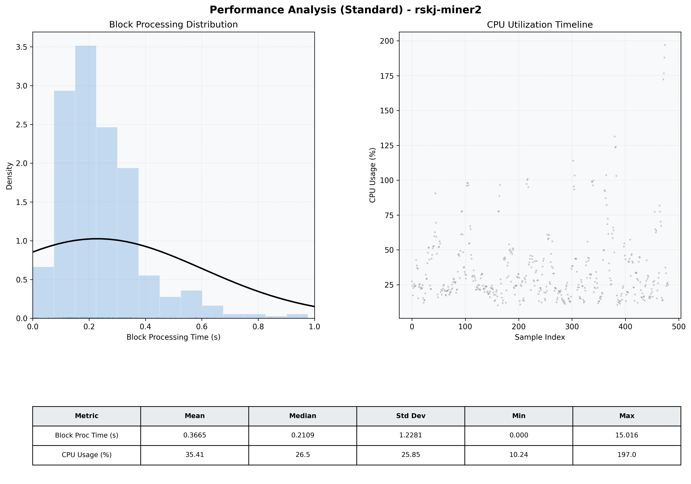

# Miner2 Quantitative Performance Report

| Category | Metric | Unit | Mean | Median | Min | Max |
| :--- | :--- | :--- | :--- | :--- | :--- | :--- |
| Processing | Block Processing Time | s | 0.366 | 0.211 | 0.000 | 15.016 |
|  | BlockExecution JMX | s | 0.147 | 0.111 | 0.002 | 0.844 |
| | Gas Consumed (per block) | M units | 22.58 | 24.67 | 0.00 | 24.79 |
| Resources | CPU Usage per Container | % | 35.41 | 26.49 | 10.24 | 197.05 |
|  | Memory Usage per Container | MiB | 3972.7 | 3971.0 | 3929.0 | 4096.0 |
| Disk I/O | Disk Read | MiB/s | 390.316 | 0.828 | 0.000 | 57112.176 |
|  | Disk Write | MiB/s | 525.294 | 4.276 | 0.000 | 64436.981 |
| Network | Received Network Traffic per Container | KiB/s | 2.69 | 2.30 | 1.16 | 9.54 |
|  | Sent Network Traffic per Container | KiB/s | 11.51 | 11.20 | 6.09 | 17.65 |

