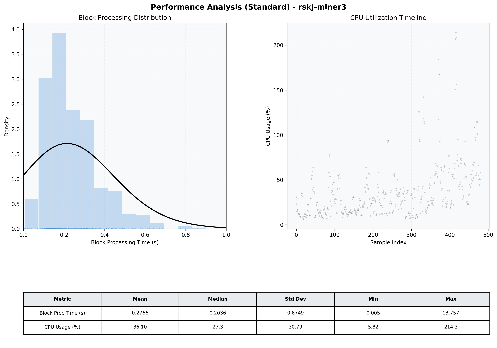

# Miner3 Quantitative Performance Report

| Category | Metric | Unit | Mean | Median | Min | Max |
| :--- | :--- | :--- | :--- | :--- | :--- | :--- |
| Processing | Block Processing Time | s | 0.277 | 0.204 | 0.005 | 13.757 |
|  | BlockExecution JMX | s | 0.140 | 0.105 | 0.002 | 0.699 |
| | Gas Consumed (per block) | M units | 22.58 | 24.67 | 0.00 | 24.79 |
| Resources | CPU Usage per Container | % | 36.10 | 27.29 | 5.82 | 214.33 |
|  | Memory Usage per Container | MiB | 3915.4 | 3905.2 | 3712.5 | 4027.4 |
| Disk I/O | Disk Read | MiB/s | 368.126 | 2.897 | 0.000 | 67908.411 |
|  | Disk Write | MiB/s | 504.021 | 4.414 | 0.552 | 73781.303 |
| Network | Received Network Traffic per Container | KiB/s | 2.72 | 2.31 | 1.18 | 9.93 |
|  | Sent Network Traffic per Container | KiB/s | 11.48 | 11.13 | 8.68 | 19.32 |

