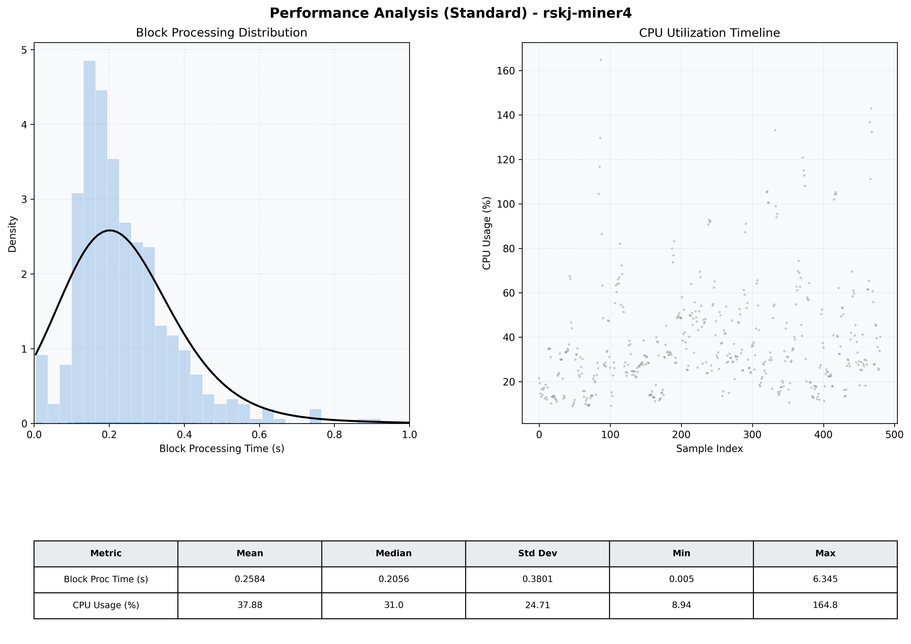

# Miner4 Quantitative Performance Report

| Category | Metric | Unit | Mean | Median | Min | Max |
| :--- | :--- | :--- | :--- | :--- | :--- | :--- |
| Processing | Block Processing Time | s | 0.258 | 0.206 | 0.005 | 6.345 |
|  | BlockExecution JMX | s | 0.133 | 0.108 | 0.003 | 0.660 |
| | Gas Consumed (per block) | M units | 22.58 | 24.67 | 0.00 | 24.79 |
| Resources | CPU Usage per Container | % | 37.88 | 30.97 | 8.94 | 164.82 |
|  | Memory Usage per Container | MiB | 3987.8 | 4003.7 | 3913.5 | 4096.0 |
| Disk I/O | Disk Read | MiB/s | 355.824 | 2.897 | 0.000 | 64210.911 |
|  | Disk Write | MiB/s | 490.335 | 4.276 | 0.138 | 71943.720 |
| Network | Received Network Traffic per Container | KiB/s | 2.73 | 2.31 | 1.19 | 9.52 |
|  | Sent Network Traffic per Container | KiB/s | 11.47 | 11.14 | 7.97 | 19.97 |

