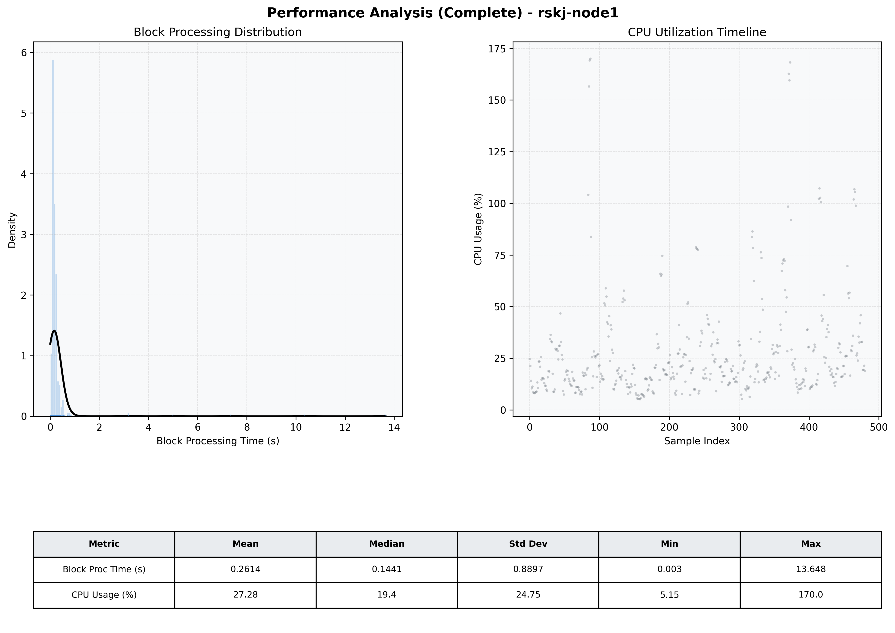

# Node1 Quantitative Performance Report

| Category | Metric | Unit | Mean | Median | Min | Max |
| :--- | :--- | :--- | :--- | :--- | :--- | :--- |
| Processing | Block Processing Time | s | 0.261 | 0.144 | 0.003 | 13.648 |
|  | BlockExecution JMX | s | 0.267 | 0.133 | 0.001 | 13.529 |
| | Gas Consumed (per block) | M units | 22.58 | 24.67 | 0.00 | 24.79 |
| Resources | CPU Usage per Container | % | 27.28 | 19.40 | 5.15 | 169.98 |
|  | Memory Usage per Container | MiB | 3847.9 | 3873.1 | 3631.1 | 4095.6 |
| Disk I/O | Disk Read | MiB/s | 350.933 | 3.172 | 0.000 | 61799.510 |
|  | Disk Write | MiB/s | 487.947 | 1.517 | 0.000 | 69049.140 |
| Network | Received Network Traffic per Container | KiB/s | 2.73 | 2.30 | 1.18 | 9.80 |
|  | Sent Network Traffic per Container | KiB/s | 11.24 | 10.97 | 5.66 | 16.58 |

