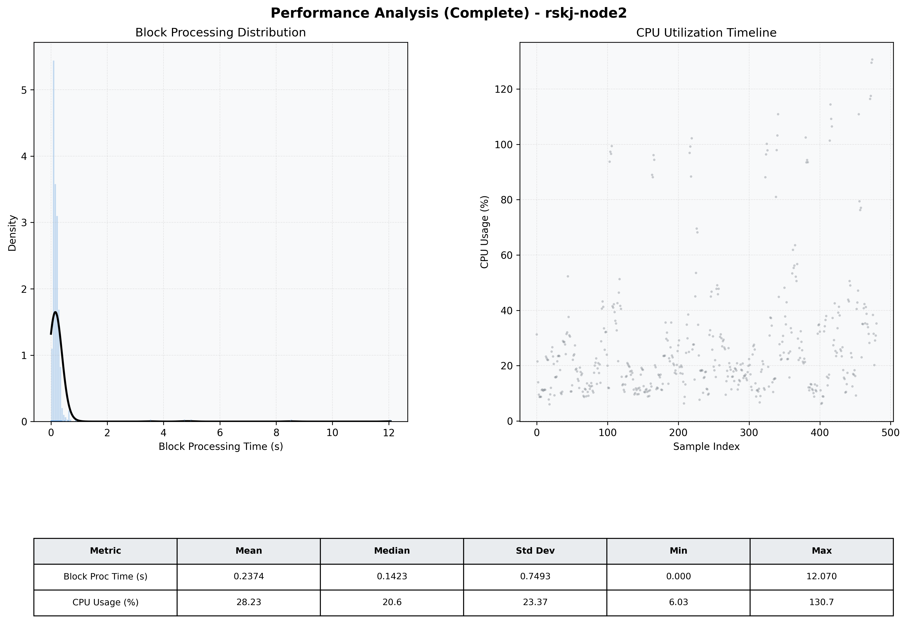

# Node2 Quantitative Performance Report

| Category | Metric | Unit | Mean | Median | Min | Max |
| :--- | :--- | :--- | :--- | :--- | :--- | :--- |
| Processing | Block Processing Time | s | 0.237 | 0.142 | 0.000 | 12.070 |
|  | BlockExecution JMX | s | 0.233 | 0.132 | 0.001 | 12.056 |
| | Gas Consumed (per block) | M units | 22.58 | 24.67 | 0.00 | 24.79 |
| Resources | CPU Usage per Container | % | 28.23 | 20.61 | 6.03 | 130.66 |
|  | Memory Usage per Container | MiB | 3981.1 | 4000.5 | 3926.4 | 4095.9 |
| Disk I/O | Disk Read | MiB/s | 352.929 | 0.828 | 0.000 | 59310.897 |
|  | Disk Write | MiB/s | 489.592 | 1.517 | 0.000 | 68931.310 |
| Network | Received Network Traffic per Container | KiB/s | 2.73 | 2.33 | 1.03 | 9.78 |
|  | Sent Network Traffic per Container | KiB/s | 11.23 | 10.95 | 5.12 | 16.54 |

