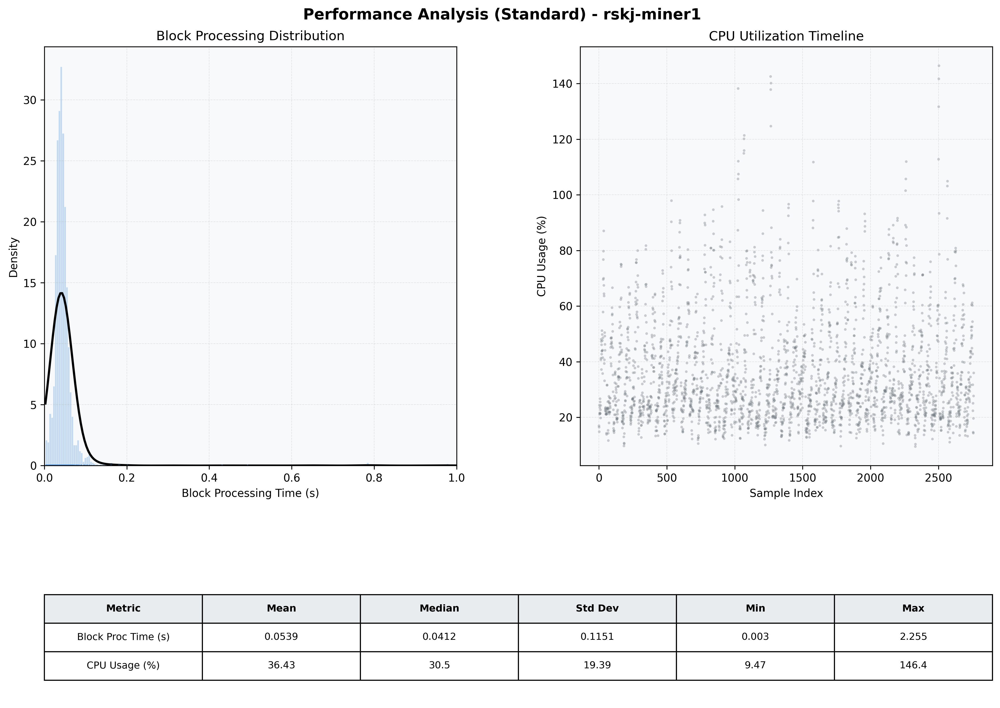

# Miner1 Quantitative Performance Report

| Category | Metric | Unit | Mean | Median | Min | Max |
| :--- | :--- | :--- | :--- | :--- | :--- | :--- |
| Processing | Block Processing Time | s | 0.054 | 0.041 | 0.003 | 2.255 |
|  | BlockExecution JMX | s | 0.028 | 0.021 | 0.001 | 0.949 |
| | Gas Consumed (per block) | M units | 6.30 | 6.89 | 0.00 | 6.97 |
| Resources | CPU Usage per Container | % | 36.43 | 30.47 | 9.47 | 146.44 |
|  | Memory Usage per Container | MiB | 3359.6 | 3873.2 | 1363.9 | 4095.8 |
| JVM | JVM Heap Used | MiB | 1484.2 | 1482.5 | 174.1 | 2830.5 |
| | JVM Heap Allocated | MiB | 2969.6 | 2969.6 | 2969.6 | 2969.6 |
| JVM GC | GC Copy Time | s | 0.0014 | 0.0012 | 0.000 | 0.010 |
| JVM GC | GC MarkSweep Time | s | 0.0001 | 0.0000 | 0.000 | 0.154 |
| Disk I/O | Disk Read | MiB/s | 22.183 | 0.000 | 0.000 | 14730.853 |
|  | Disk Write | MiB/s | 205.101 | 73.382 | 0.000 | 25582.399 |
| Network | Received Network Traffic per Container | KiB/s | 23.09 | 12.62 | 1.43 | 73.71 |
|  | Sent Network Traffic per Container | KiB/s | 28.01 | 21.54 | 9.89 | 72.73 |

