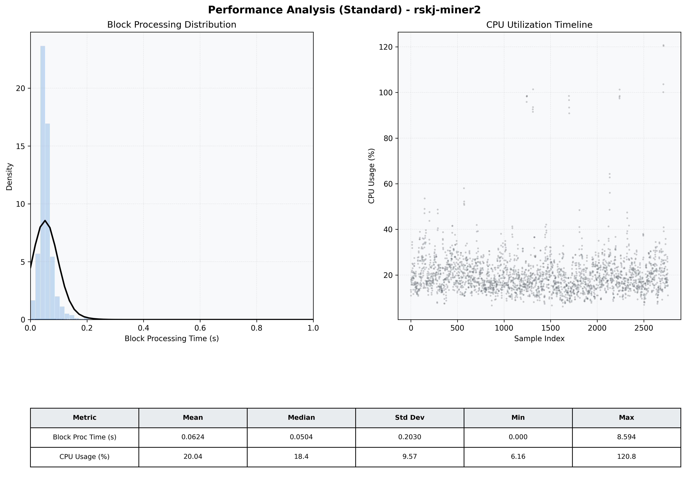

# Miner2 Quantitative Performance Report

| Category | Metric | Unit | Mean | Median | Min | Max |
| :--- | :--- | :--- | :--- | :--- | :--- | :--- |
| Processing | Block Processing Time | s | 0.062 | 0.050 | 0.000 | 8.594 |
|  | BlockExecution JMX | s | 0.031 | 0.028 | 0.002 | 0.249 |
| | Gas Consumed (per block) | M units | 6.30 | 6.89 | 0.00 | 6.97 |
| Resources | CPU Usage per Container | % | 20.04 | 18.35 | 6.16 | 120.76 |
|  | Memory Usage per Container | MiB | 3368.5 | 3866.5 | 1254.7 | 4096.0 |
| JVM | JVM Heap Used | MiB | 1555.9 | 1565.0 | 129.0 | 2878.9 |
| | JVM Heap Allocated | MiB | 2969.6 | 2969.6 | 2969.6 | 2969.6 |
| JVM GC | GC Copy Time | s | 0.0013 | 0.0009 | 0.000 | 0.013 |
| JVM GC | GC MarkSweep Time | s | 0.0001 | 0.0000 | 0.000 | 0.243 |
| Disk I/O | Disk Read | MiB/s | 30.234 | 0.000 | 0.000 | 43083.204 |
|  | Disk Write | MiB/s | 78.717 | 4.414 | 0.000 | 51941.795 |
| Network | Received Network Traffic per Container | KiB/s | 2.80 | 2.26 | 1.08 | 10.46 |
|  | Sent Network Traffic per Container | KiB/s | 11.52 | 11.07 | 5.56 | 19.66 |

