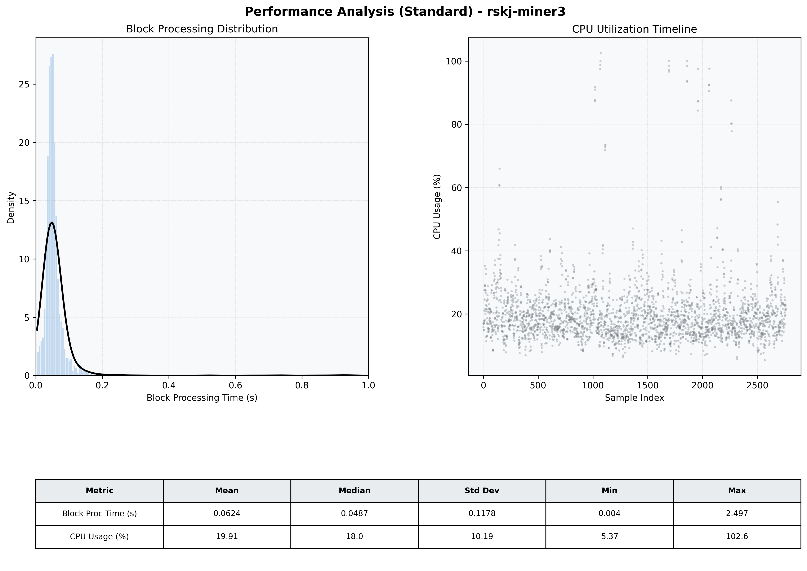

# Miner3 Quantitative Performance Report

| Category | Metric | Unit | Mean | Median | Min | Max |
| :--- | :--- | :--- | :--- | :--- | :--- | :--- |
| Processing | Block Processing Time | s | 0.062 | 0.049 | 0.004 | 2.497 |
|  | BlockExecution JMX | s | 0.034 | 0.026 | 0.001 | 0.922 |
| | Gas Consumed (per block) | M units | 6.30 | 6.89 | 0.00 | 6.97 |
| Resources | CPU Usage per Container | % | 19.91 | 17.98 | 5.37 | 102.56 |
|  | Memory Usage per Container | MiB | 3278.6 | 3633.3 | 1317.0 | 4096.0 |
| JVM | JVM Heap Used | MiB | 1491.9 | 1480.5 | 153.1 | 2868.5 |
| | JVM Heap Allocated | MiB | 2969.6 | 2969.6 | 2969.6 | 2969.6 |
| JVM GC | GC Copy Time | s | 0.0014 | 0.0013 | 0.000 | 0.008 |
| JVM GC | GC MarkSweep Time | s | 0.0001 | 0.0000 | 0.000 | 0.226 |
| Disk I/O | Disk Read | MiB/s | 16.676 | 0.000 | 0.000 | 16246.077 |
|  | Disk Write | MiB/s | 108.999 | 4.414 | 0.000 | 25490.120 |
| Network | Received Network Traffic per Container | KiB/s | 2.81 | 2.29 | 1.15 | 10.74 |
|  | Sent Network Traffic per Container | KiB/s | 11.53 | 11.06 | 9.68 | 19.40 |

