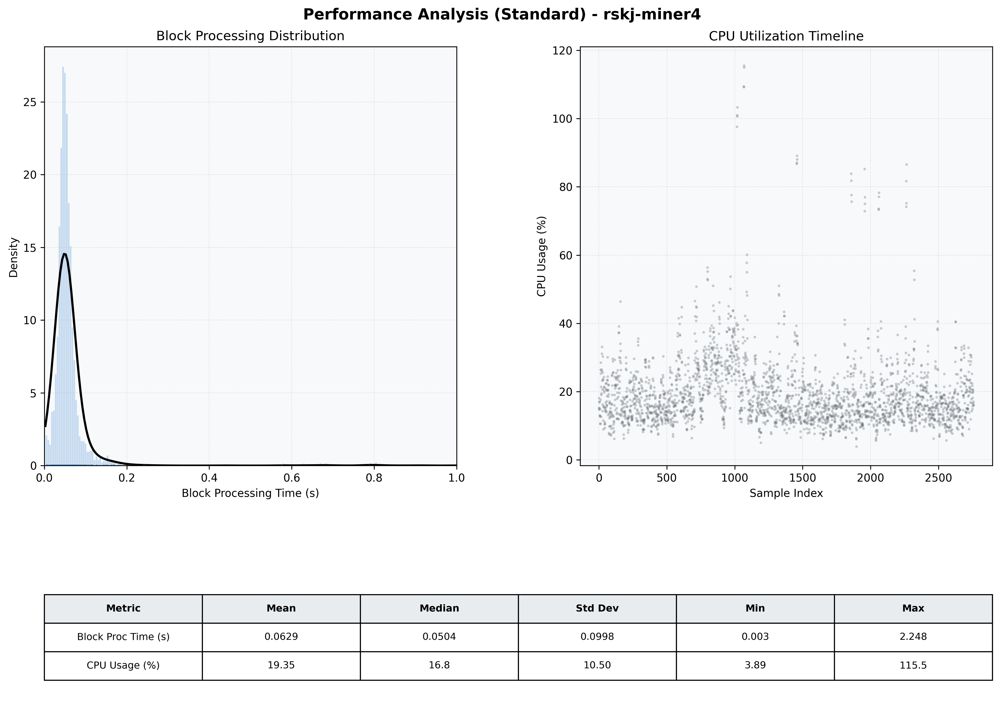

# Miner4 Quantitative Performance Report

| Category | Metric | Unit | Mean | Median | Min | Max |
| :--- | :--- | :--- | :--- | :--- | :--- | :--- |
| Processing | Block Processing Time | s | 0.063 | 0.050 | 0.003 | 2.248 |
|  | BlockExecution JMX | s | 0.037 | 0.027 | 0.001 | 0.975 |
| | Gas Consumed (per block) | M units | 6.30 | 6.89 | 0.00 | 6.97 |
| Resources | CPU Usage per Container | % | 19.35 | 16.78 | 3.89 | 115.48 |
|  | Memory Usage per Container | MiB | 3313.9 | 3851.4 | 1313.6 | 4095.8 |
| JVM | JVM Heap Used | MiB | 1493.1 | 1499.1 | 116.1 | 2868.3 |
| | JVM Heap Allocated | MiB | 2969.6 | 2969.6 | 2969.6 | 2969.6 |
| JVM GC | GC Copy Time | s | 0.0013 | 0.0012 | 0.000 | 0.010 |
| JVM GC | GC MarkSweep Time | s | 0.0001 | 0.0000 | 0.000 | 0.166 |
| Disk I/O | Disk Read | MiB/s | 17.653 | 0.000 | 0.000 | 14942.998 |
|  | Disk Write | MiB/s | 106.414 | 4.414 | 0.000 | 24648.436 |
| Network | Received Network Traffic per Container | KiB/s | 2.80 | 2.27 | 1.15 | 10.68 |
|  | Sent Network Traffic per Container | KiB/s | 11.60 | 11.13 | 7.74 | 20.12 |

