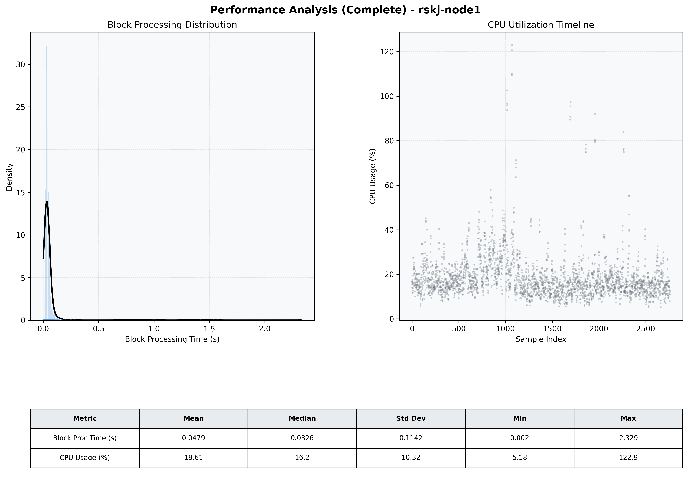

# Node1 Quantitative Performance Report

| Category | Metric | Unit | Mean | Median | Min | Max |
| :--- | :--- | :--- | :--- | :--- | :--- | :--- |
| Processing | Block Processing Time | s | 0.048 | 0.033 | 0.002 | 2.329 |
|  | BlockExecution JMX | s | 0.043 | 0.028 | 0.001 | 2.203 |
| | Gas Consumed (per block) | M units | 6.30 | 6.89 | 0.00 | 6.97 |
| Resources | CPU Usage per Container | % | 18.61 | 16.16 | 5.18 | 122.89 |
|  | Memory Usage per Container | MiB | 3250.0 | 3583.4 | 1312.5 | 4095.7 |
| JVM | JVM Heap Used | MiB | 1488.9 | 1487.0 | 154.4 | 2871.2 |
| | JVM Heap Allocated | MiB | 2969.6 | 2969.6 | 2969.6 | 2969.6 |
| JVM GC | GC Copy Time | s | 0.0014 | 0.0014 | 0.000 | 0.007 |
| JVM GC | GC MarkSweep Time | s | 0.0002 | 0.0000 | 0.000 | 0.223 |
| Disk I/O | Disk Read | MiB/s | 15.094 | 0.000 | 0.000 | 15109.349 |
|  | Disk Write | MiB/s | 103.119 | 1.379 | 0.000 | 25483.224 |
| Network | Received Network Traffic per Container | KiB/s | 2.82 | 2.29 | 1.15 | 10.69 |
|  | Sent Network Traffic per Container | KiB/s | 11.31 | 10.89 | 7.83 | 17.19 |

