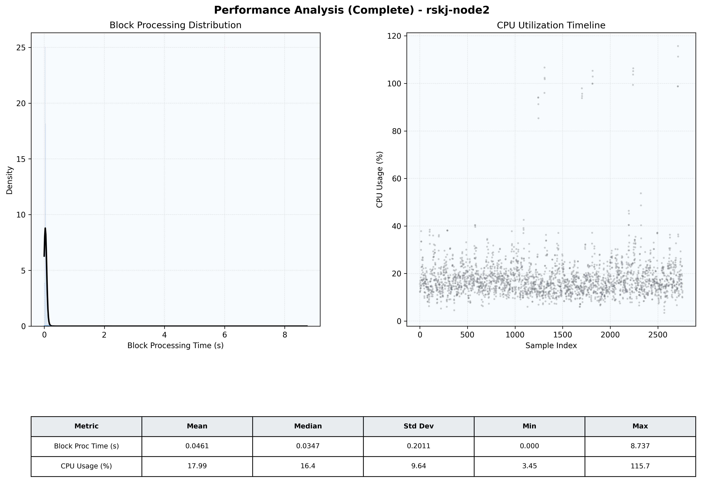

# Node2 Quantitative Performance Report

| Category | Metric | Unit | Mean | Median | Min | Max |
| :--- | :--- | :--- | :--- | :--- | :--- | :--- |
| Processing | Block Processing Time | s | 0.046 | 0.035 | 0.000 | 8.737 |
|  | BlockExecution JMX | s | 0.047 | 0.031 | 0.001 | 11.924 |
| | Gas Consumed (per block) | M units | 6.30 | 6.89 | 0.00 | 6.97 |
| Resources | CPU Usage per Container | % | 17.99 | 16.37 | 3.45 | 115.71 |
|  | Memory Usage per Container | MiB | 3312.0 | 3799.6 | 1205.6 | 4095.9 |
| JVM | JVM Heap Used | MiB | 1550.4 | 1554.9 | 126.3 | 2862.6 |
| | JVM Heap Allocated | MiB | 2969.6 | 2969.6 | 2969.6 | 2969.6 |
| JVM GC | GC Copy Time | s | 0.0012 | 0.0009 | 0.000 | 0.027 |
| JVM GC | GC MarkSweep Time | s | 0.0001 | 0.0000 | 0.000 | 0.192 |
| Disk I/O | Disk Read | MiB/s | 26.190 | 0.000 | 0.000 | 41341.747 |
|  | Disk Write | MiB/s | 76.086 | 1.241 | 0.000 | 51924.554 |
| Network | Received Network Traffic per Container | KiB/s | 2.83 | 2.31 | 1.12 | 10.67 |
|  | Sent Network Traffic per Container | KiB/s | 11.26 | 10.84 | 8.29 | 17.17 |

