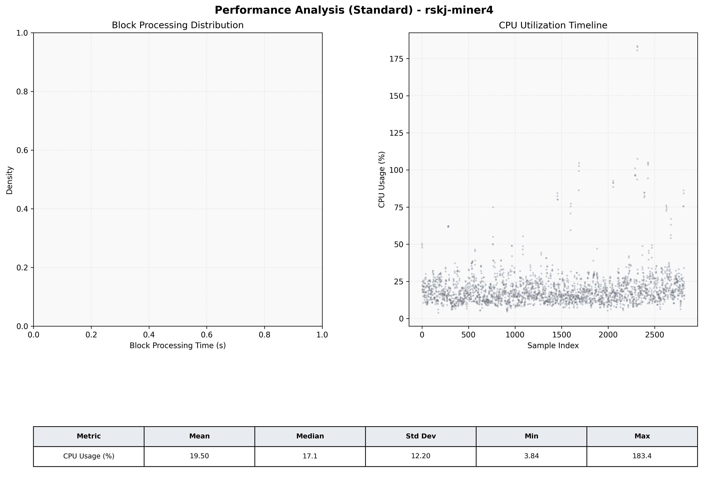

# Miner4 Quantitative Performance Report

| Category | Metric | Unit | Mean | Median | Min | Max |
| :--- | :--- | :--- | :--- | :--- | :--- | :--- |
| Processing | Block Processing Time | s | N/A | N/A | N/A | N/A |
|  | BlockExecution JMX | s | 0.041 | 0.031 | 0.003 | 0.986 |
| | Gas Consumed (per block) | M units | 6.13 | 6.23 | 0.00 | 6.33 |
| Resources | CPU Usage per Container | % | 19.50 | 17.11 | 3.84 | 183.39 |
|  | Memory Usage per Container | MiB | 2998.8 | 3207.0 | 1201.1 | 4095.2 |
| JVM | JVM Heap Used | MiB | 1390.5 | 1298.9 | 111.3 | 2868.0 |
| | JVM Heap Allocated | MiB | 2969.6 | 2969.6 | 2969.6 | 2969.6 |
| JVM GC | GC Copy Time | s | 0.0016 | 0.0014 | 0.000 | 0.016 |
| JVM GC | GC MarkSweep Time | s | 0.0001 | 0.0000 | 0.000 | 0.374 |
| Disk I/O | Disk Read | MiB/s | 7.847 | 0.000 | 0.000 | 6982.897 |
|  | Disk Write | MiB/s | 92.024 | 9.793 | 0.000 | 22757.241 |
| Network | Received Network Traffic per Container | KiB/s | 2.88 | 1.81 | 0.55 | 11.81 |
|  | Sent Network Traffic per Container | KiB/s | 11.02 | 10.64 | 4.66 | 19.16 |

