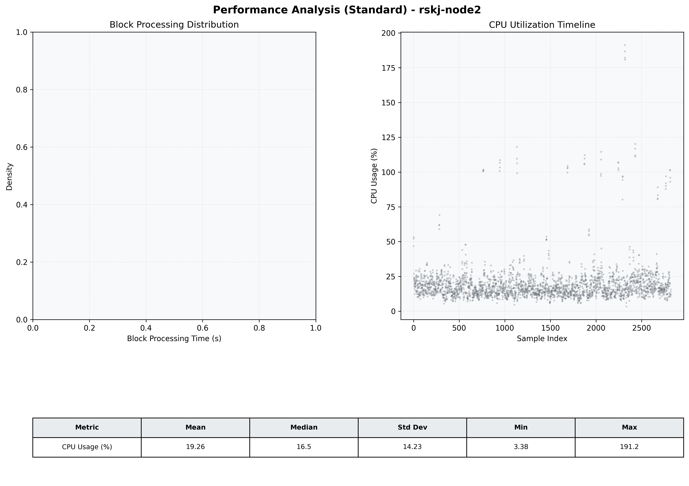

# Node2 Quantitative Performance Report

| Category | Metric | Unit | Mean | Median | Min | Max |
| :--- | :--- | :--- | :--- | :--- | :--- | :--- |
| Processing | Block Processing Time | s | N/A | N/A | N/A | N/A |
|  | BlockExecution JMX | s | 0.039 | 0.032 | 0.002 | 0.905 |
| | Gas Consumed (per block) | M units | 6.13 | 6.23 | 0.00 | 6.33 |
| Resources | CPU Usage per Container | % | 19.26 | 16.47 | 3.38 | 191.22 |
|  | Memory Usage per Container | MiB | 2911.1 | 3102.2 | 1157.3 | 4095.5 |
| JVM | JVM Heap Used | MiB | 1394.7 | 1314.4 | 96.7 | 2840.3 |
| | JVM Heap Allocated | MiB | 2969.6 | 2969.6 | 2969.6 | 2969.6 |
| JVM GC | GC Copy Time | s | 0.0016 | 0.0015 | 0.000 | 0.012 |
| JVM GC | GC MarkSweep Time | s | 0.0003 | 0.0000 | 0.000 | 0.470 |
| Disk I/O | Disk Read | MiB/s | 5.407 | 0.000 | 0.000 | 6009.310 |
|  | Disk Write | MiB/s | 82.188 | 1.241 | 0.000 | 17586.537 |
| Network | Received Network Traffic per Container | KiB/s | 2.87 | 1.84 | 0.53 | 11.64 |
|  | Sent Network Traffic per Container | KiB/s | 10.91 | 10.54 | 4.65 | 18.88 |

