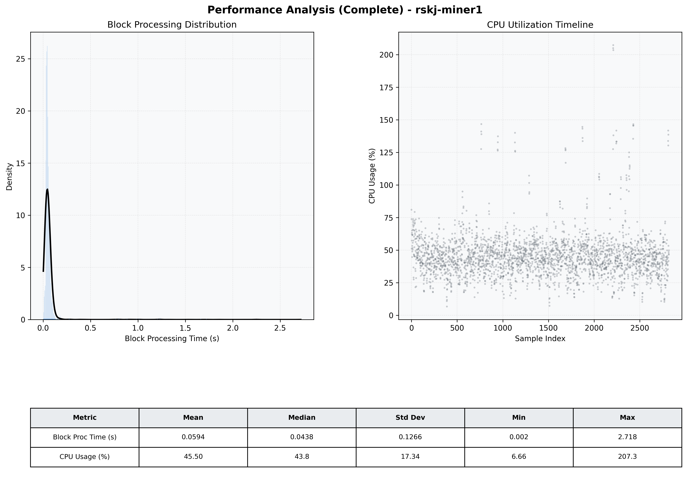

# Miner1 Quantitative Performance Report

| Category | Metric | Unit | Mean | Median | Min | Max |
| :--- | :--- | :--- | :--- | :--- | :--- | :--- |
| Processing | Block Processing Time | s | 0.059 | 0.044 | 0.002 | 2.718 |
|  | BlockExecution JMX | s | 0.037 | 0.022 | 0.003 | 2.665 |
| | Gas Consumed (per block) | M units | 6.13 | 6.23 | 0.00 | 6.33 |
| Resources | CPU Usage per Container | % | 45.50 | 43.76 | 6.66 | 207.28 |
|  | Memory Usage per Container | MiB | 3118.9 | 3398.9 | 1179.5 | 4095.8 |
| JVM | JVM Heap Used | MiB | 1375.1 | 1295.3 | 115.8 | 2856.7 |
| | JVM Heap Allocated | MiB | 2969.6 | 2969.6 | 2969.6 | 2969.6 |
| JVM GC | GC Copy Time | s | 0.0018 | 0.0015 | 0.000 | 0.025 |
| JVM GC | GC MarkSweep Time | s | 0.0002 | 0.0000 | 0.000 | 0.429 |
| Disk I/O | Disk Read | MiB/s | 11.724 | 0.000 | 0.000 | 15374.323 |
|  | Disk Write | MiB/s | 200.246 | 147.857 | 0.000 | 22758.578 |
| Network | Received Network Traffic per Container | KiB/s | 34.52 | 42.42 | 0.72 | 45.93 |
|  | Sent Network Traffic per Container | KiB/s | 39.37 | 45.72 | 5.12 | 54.69 |

