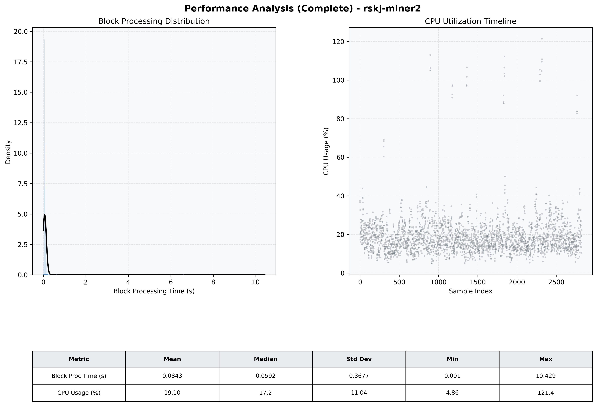

# Miner2 Quantitative Performance Report

| Category | Metric | Unit | Mean | Median | Min | Max |
| :--- | :--- | :--- | :--- | :--- | :--- | :--- |
| Processing | Block Processing Time | s | 0.084 | 0.059 | 0.001 | 10.429 |
|  | BlockExecution JMX | s | 0.057 | 0.031 | 0.002 | 10.388 |
| | Gas Consumed (per block) | M units | 6.13 | 6.23 | 0.00 | 6.33 |
| Resources | CPU Usage per Container | % | 19.10 | 17.17 | 4.86 | 121.42 |
|  | Memory Usage per Container | MiB | 3123.1 | 3501.7 | 1196.0 | 4095.7 |
| JVM | JVM Heap Used | MiB | 1394.7 | 1311.5 | 101.8 | 2874.6 |
| | JVM Heap Allocated | MiB | 2969.6 | 2969.6 | 2969.6 | 2969.6 |
| JVM GC | GC Copy Time | s | 0.0015 | 0.0011 | 0.000 | 0.018 |
| JVM GC | GC MarkSweep Time | s | 0.0001 | 0.0000 | 0.000 | 0.394 |
| Disk I/O | Disk Read | MiB/s | 18.398 | 0.000 | 0.000 | 20487.034 |
|  | Disk Write | MiB/s | 63.755 | 9.517 | 0.000 | 34333.322 |
| Network | Received Network Traffic per Container | KiB/s | 2.89 | 1.82 | 0.56 | 11.70 |
|  | Sent Network Traffic per Container | KiB/s | 11.02 | 10.64 | 2.66 | 19.60 |

