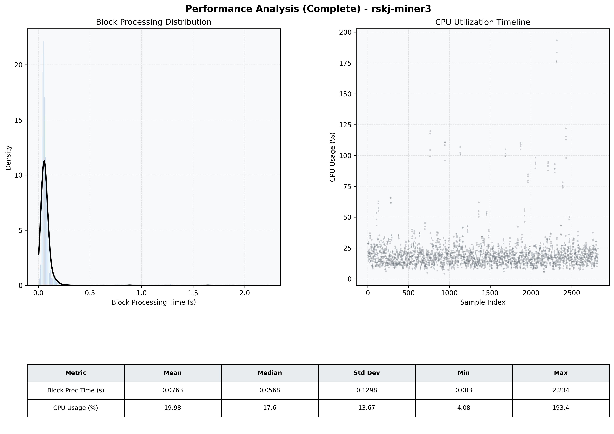

# Miner3 Quantitative Performance Report

| Category | Metric | Unit | Mean | Median | Min | Max |
| :--- | :--- | :--- | :--- | :--- | :--- | :--- |
| Processing | Block Processing Time | s | 0.076 | 0.057 | 0.003 | 2.234 |
|  | BlockExecution JMX | s | 0.049 | 0.030 | 0.001 | 2.161 |
| | Gas Consumed (per block) | M units | 6.13 | 6.23 | 0.00 | 6.33 |
| Resources | CPU Usage per Container | % | 19.98 | 17.57 | 4.08 | 193.42 |
|  | Memory Usage per Container | MiB | 3050.6 | 3262.9 | 1164.8 | 4095.8 |
| JVM | JVM Heap Used | MiB | 1393.0 | 1320.9 | 97.7 | 2841.9 |
| | JVM Heap Allocated | MiB | 2969.6 | 2969.6 | 2969.6 | 2969.6 |
| JVM GC | GC Copy Time | s | 0.0017 | 0.0014 | 0.000 | 0.016 |
| JVM GC | GC MarkSweep Time | s | 0.0002 | 0.0000 | 0.000 | 0.431 |
| Disk I/O | Disk Read | MiB/s | 6.214 | 0.000 | 0.000 | 6535.674 |
|  | Disk Write | MiB/s | 92.151 | 9.792 | 0.000 | 17504.742 |
| Network | Received Network Traffic per Container | KiB/s | 2.87 | 1.80 | 0.56 | 11.67 |
|  | Sent Network Traffic per Container | KiB/s | 11.02 | 10.64 | 2.21 | 19.64 |

