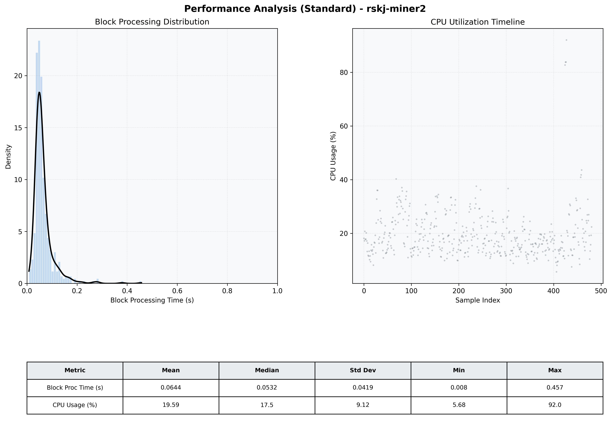

# Miner2 Quantitative Performance Report

| Category | Metric | Unit | Mean | Median | Min | Max |
| :--- | :--- | :--- | :--- | :--- | :--- | :--- |
| Processing | Block Processing Time | s | 0.064 | 0.053 | 0.008 | 0.457 |
|  | BlockExecution JMX | s | 0.036 | 0.028 | 0.005 | 0.379 |
| | Gas Consumed (per block) | M units | 6.10 | 6.23 | 0.00 | 6.33 |
| Resources | CPU Usage per Container | % | 19.59 | 17.55 | 5.68 | 92.03 |
|  | Memory Usage per Container | MiB | 3934.6 | 3957.7 | 3820.1 | 4070.4 |
| JVM | JVM Heap Used | MiB | 998.5 | 1002.7 | 419.6 | 1596.5 |
| | JVM Heap Allocated | MiB | 2969.6 | 2969.6 | 2969.6 | 2969.6 |
| JVM GC | GC Copy Time | s | 0.0015 | 0.0010 | 0.000 | 0.013 |
| JVM GC | GC MarkSweep Time | s | 0.0000 | 0.0000 | 0.000 | 0.000 |
| Disk I/O | Disk Read | MiB/s | 92.727 | 0.000 | 0.000 | 20487.034 |
|  | Disk Write | MiB/s | 155.708 | 10.206 | 0.552 | 34333.322 |
| Network | Received Network Traffic per Container | KiB/s | 3.06 | 1.86 | 1.18 | 11.70 |
|  | Sent Network Traffic per Container | KiB/s | 11.72 | 10.78 | 9.73 | 19.60 |

