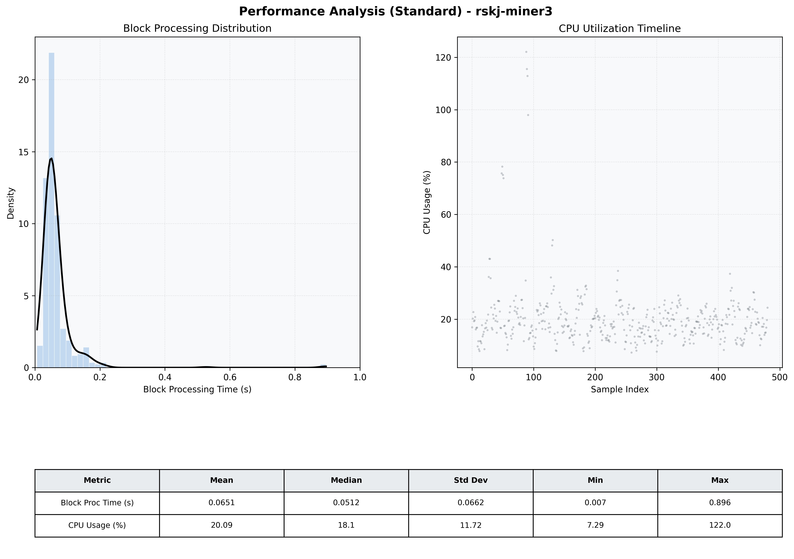

# Miner3 Quantitative Performance Report

| Category | Metric | Unit | Mean | Median | Min | Max |
| :--- | :--- | :--- | :--- | :--- | :--- | :--- |
| Processing | Block Processing Time | s | 0.065 | 0.051 | 0.007 | 0.896 |
|  | BlockExecution JMX | s | 0.038 | 0.026 | 0.004 | 0.887 |
| | Gas Consumed (per block) | M units | 6.10 | 6.23 | 0.00 | 6.33 |
| Resources | CPU Usage per Container | % | 20.09 | 18.14 | 7.29 | 122.04 |
|  | Memory Usage per Container | MiB | 3965.3 | 3951.3 | 3866.6 | 4095.8 |
| JVM | JVM Heap Used | MiB | 1016.1 | 1024.5 | 423.3 | 1576.4 |
| | JVM Heap Allocated | MiB | 2969.6 | 2969.6 | 2969.6 | 2969.6 |
| JVM GC | GC Copy Time | s | 0.0015 | 0.0014 | 0.000 | 0.006 |
| JVM GC | GC MarkSweep Time | s | 0.0000 | 0.0000 | 0.000 | 0.000 |
| Disk I/O | Disk Read | MiB/s | 15.431 | 0.276 | 0.000 | 3393.454 |
|  | Disk Write | MiB/s | 128.842 | 10.626 | 0.552 | 16564.610 |
| Network | Received Network Traffic per Container | KiB/s | 3.04 | 1.87 | 1.15 | 11.67 |
|  | Sent Network Traffic per Container | KiB/s | 11.75 | 10.77 | 9.76 | 19.64 |

