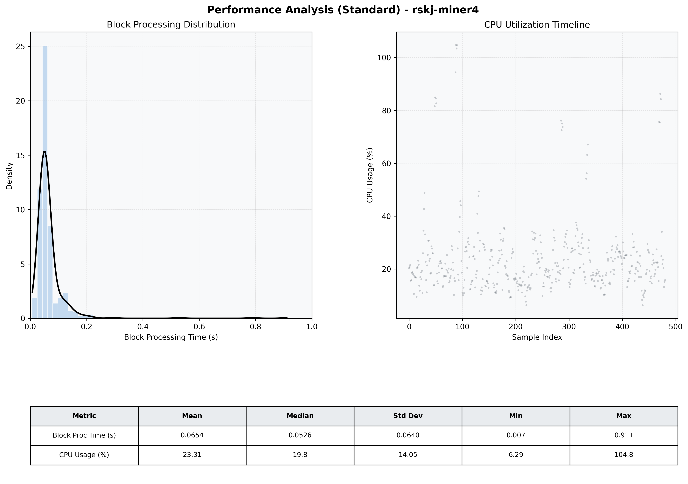

# Miner4 Quantitative Performance Report

| Category | Metric | Unit | Mean | Median | Min | Max |
| :--- | :--- | :--- | :--- | :--- | :--- | :--- |
| Processing | Block Processing Time | s | 0.065 | 0.053 | 0.007 | 0.911 |
|  | BlockExecution JMX | s | 0.038 | 0.027 | 0.004 | 0.829 |
| | Gas Consumed (per block) | M units | 6.10 | 6.23 | 0.00 | 6.33 |
| Resources | CPU Usage per Container | % | 23.31 | 19.82 | 6.29 | 104.76 |
|  | Memory Usage per Container | MiB | 3927.2 | 3931.5 | 3864.6 | 4095.2 |
| JVM | JVM Heap Used | MiB | 1018.8 | 1024.9 | 410.2 | 1601.1 |
| | JVM Heap Allocated | MiB | 2969.6 | 2969.6 | 2969.6 | 2969.6 |
| JVM GC | GC Copy Time | s | 0.0015 | 0.0014 | 0.000 | 0.006 |
| JVM GC | GC MarkSweep Time | s | 0.0000 | 0.0000 | 0.000 | 0.000 |
| Disk I/O | Disk Read | MiB/s | 13.844 | 0.276 | 0.000 | 3409.793 |
|  | Disk Write | MiB/s | 127.425 | 10.621 | 0.552 | 16554.364 |
| Network | Received Network Traffic per Container | KiB/s | 3.04 | 1.87 | 1.18 | 11.81 |
|  | Sent Network Traffic per Container | KiB/s | 11.73 | 10.69 | 9.77 | 19.16 |

