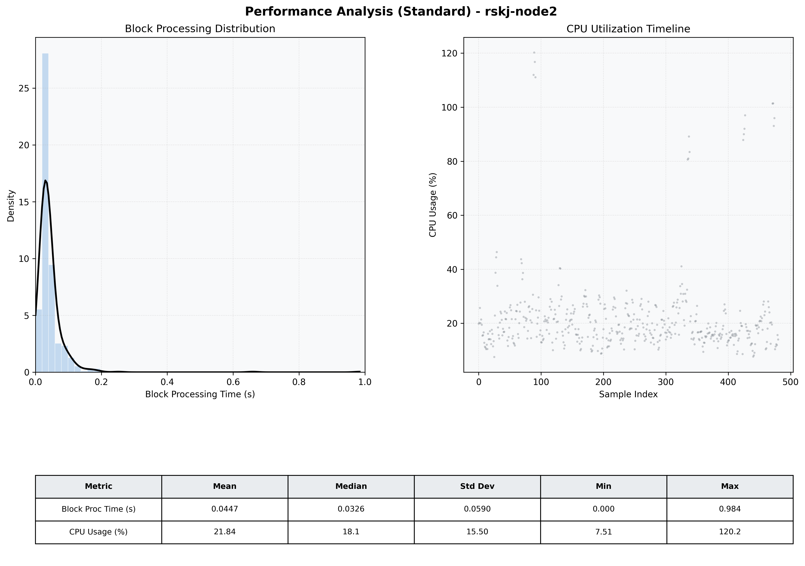

# Node2 Quantitative Performance Report

| Category | Metric | Unit | Mean | Median | Min | Max |
| :--- | :--- | :--- | :--- | :--- | :--- | :--- |
| Processing | Block Processing Time | s | 0.045 | 0.033 | 0.000 | 0.984 |
|  | BlockExecution JMX | s | 0.037 | 0.027 | 0.002 | 0.905 |
| | Gas Consumed (per block) | M units | 6.10 | 6.23 | 0.00 | 6.33 |
| Resources | CPU Usage per Container | % | 21.84 | 18.09 | 7.51 | 120.23 |
|  | Memory Usage per Container | MiB | 3677.4 | 3711.6 | 3427.5 | 4021.8 |
| JVM | JVM Heap Used | MiB | 1010.9 | 1019.4 | 422.6 | 1580.2 |
| | JVM Heap Allocated | MiB | 2969.6 | 2969.6 | 2969.6 | 2969.6 |
| JVM GC | GC Copy Time | s | 0.0016 | 0.0015 | 0.000 | 0.007 |
| JVM GC | GC MarkSweep Time | s | 0.0000 | 0.0000 | 0.000 | 0.000 |
| Disk I/O | Disk Read | MiB/s | 25.028 | 0.276 | 0.000 | 6009.310 |
|  | Disk Write | MiB/s | 118.310 | 1.379 | 0.000 | 16537.849 |
| Network | Received Network Traffic per Container | KiB/s | 3.05 | 1.92 | 1.16 | 11.64 |
|  | Sent Network Traffic per Container | KiB/s | 11.62 | 10.68 | 9.73 | 18.88 |

