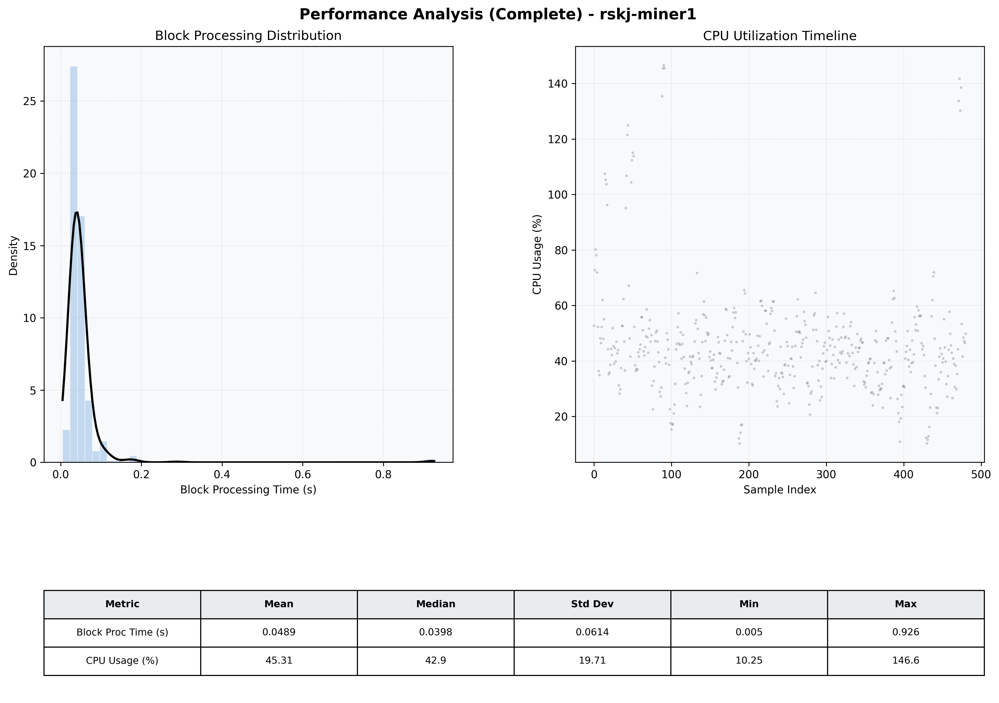

# Miner1 Quantitative Performance Report

| Category | Metric | Unit | Mean | Median | Min | Max |
| :--- | :--- | :--- | :--- | :--- | :--- | :--- |
| Processing | Block Processing Time | s | 0.049 | 0.040 | 0.005 | 0.926 |
|  | BlockExecution JMX | s | 0.029 | 0.020 | 0.003 | 1.124 |
| | Gas Consumed (per block) | M units | 6.10 | 6.23 | 0.00 | 6.33 |
| Resources | CPU Usage per Container | % | 45.31 | 42.88 | 10.25 | 146.58 |
|  | Memory Usage per Container | MiB | 3926.0 | 3915.5 | 3797.9 | 4091.3 |
| JVM | JVM Heap Used | MiB | 1091.5 | 1071.4 | 495.4 | 1699.4 |
| | JVM Heap Allocated | MiB | 2969.6 | 2969.6 | 2969.6 | 2969.6 |
| JVM GC | GC Copy Time | s | 0.0019 | 0.0016 | 0.000 | 0.012 |
| JVM GC | GC MarkSweep Time | s | 0.0000 | 0.0000 | 0.000 | 0.000 |
| Disk I/O | Disk Read | MiB/s | 16.800 | 0.138 | 0.000 | 4202.366 |
|  | Disk Write | MiB/s | 249.409 | 148.966 | 0.000 | 20365.517 |
| Network | Received Network Traffic per Container | KiB/s | 36.69 | 42.49 | 1.54 | 44.75 |
|  | Sent Network Traffic per Container | KiB/s | 41.90 | 45.85 | 10.34 | 54.43 |

