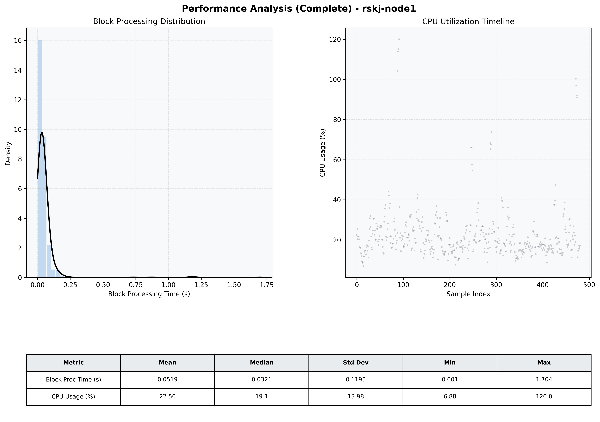

# Node1 Quantitative Performance Report

| Category | Metric | Unit | Mean | Median | Min | Max |
| :--- | :--- | :--- | :--- | :--- | :--- | :--- |
| Processing | Block Processing Time | s | 0.052 | 0.032 | 0.001 | 1.704 |
|  | BlockExecution JMX | s | 0.050 | 0.027 | 0.002 | 2.976 |
| | Gas Consumed (per block) | M units | 6.10 | 6.23 | 0.00 | 6.33 |
| Resources | CPU Usage per Container | % | 22.50 | 19.07 | 6.88 | 120.03 |
|  | Memory Usage per Container | MiB | 3909.8 | 3891.0 | 3853.3 | 4033.8 |
| JVM | JVM Heap Used | MiB | 1016.8 | 1035.1 | 421.9 | 1567.4 |
| | JVM Heap Allocated | MiB | 2969.6 | 2969.6 | 2969.6 | 2969.6 |
| JVM GC | GC Copy Time | s | 0.0016 | 0.0015 | 0.000 | 0.009 |
| JVM GC | GC MarkSweep Time | s | 0.0000 | 0.0000 | 0.000 | 0.000 |
| Disk I/O | Disk Read | MiB/s | 12.299 | 0.000 | 0.000 | 2742.766 |
|  | Disk Write | MiB/s | 118.303 | 1.379 | 0.000 | 16539.090 |
| Network | Received Network Traffic per Container | KiB/s | 3.05 | 1.88 | 1.16 | 11.66 |
|  | Sent Network Traffic per Container | KiB/s | 11.60 | 10.62 | 9.72 | 18.99 |

