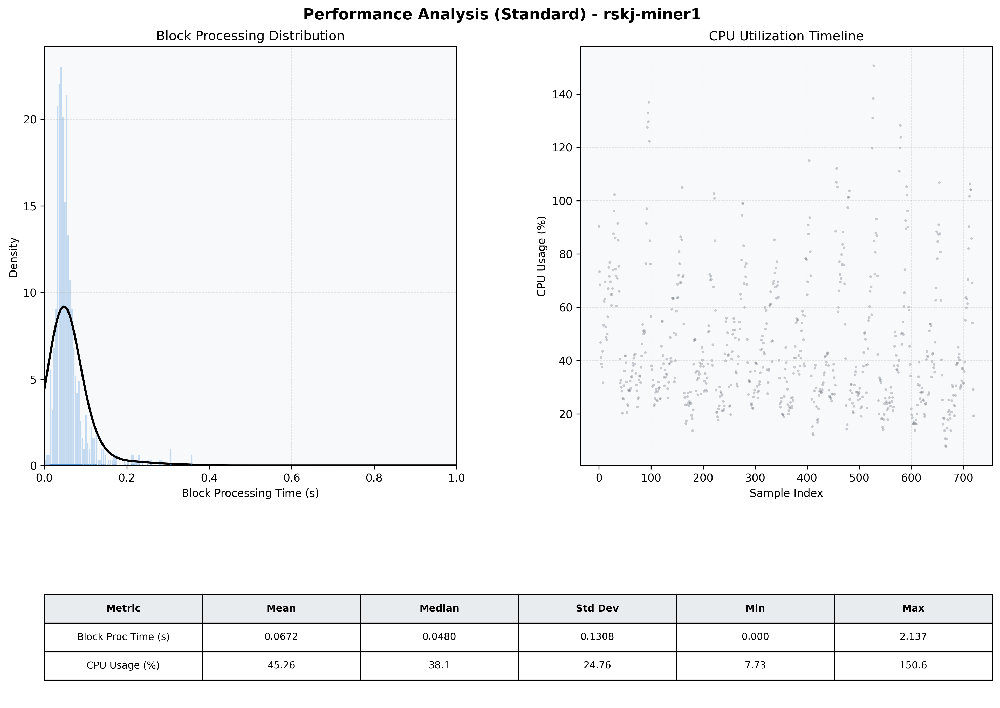

# Miner1 Quantitative Performance Report

| Category | Metric | Unit | Mean | Median | Min | Max |
| :--- | :--- | :--- | :--- | :--- | :--- | :--- |
| Processing | Block Processing Time | s | 0.067 | 0.048 | 0.000 | 2.137 |
|  | BlockExecution JMX | s | 0.037 | 0.027 | 0.005 | 0.387 |
| | Gas Consumed (per block) | M units | 6.33 | 6.89 | 0.00 | 6.97 |
| Resources | CPU Usage per Container | % | 45.26 | 38.13 | 7.73 | 150.63 |
|  | Memory Usage per Container | MiB | 2077.6 | 2092.9 | 1192.2 | 2842.7 |
| JVM | JVM Heap Used | MiB | 965.3 | 981.0 | 128.1 | 1747.6 |
| | JVM Heap Allocated | MiB | 2969.6 | 2969.6 | 2969.6 | 2969.6 |
| JVM GC | GC Copy Time | s | 0.0020 | 0.0017 | 0.000 | 0.012 |
| JVM GC | GC MarkSweep Time | s | 0.0000 | 0.0000 | 0.000 | 0.000 |
| Disk I/O | Disk Read | MiB/s | 0.002 | 0.000 | 0.000 | 0.828 |
|  | Disk Write | MiB/s | 169.789 | 77.109 | 0.000 | 11568.276 |
| Network | Received Network Traffic per Container | KiB/s | 23.15 | 16.27 | 1.47 | 71.50 |
|  | Sent Network Traffic per Container | KiB/s | 28.13 | 22.86 | 9.97 | 69.11 |

