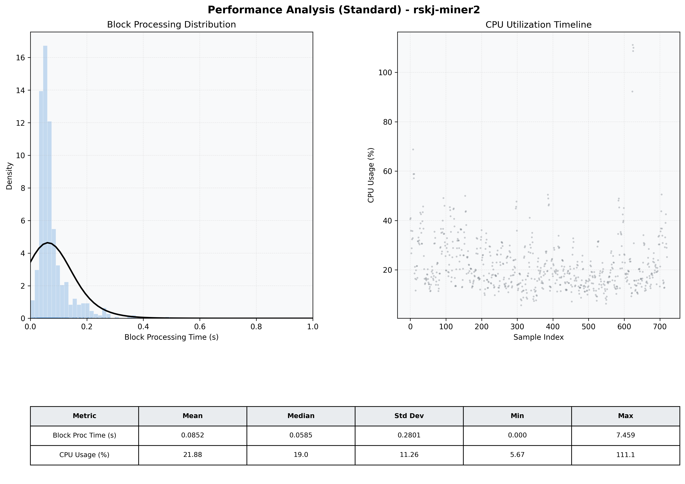

# Miner2 Quantitative Performance Report

| Category | Metric | Unit | Mean | Median | Min | Max |
| :--- | :--- | :--- | :--- | :--- | :--- | :--- |
| Processing | Block Processing Time | s | 0.085 | 0.059 | 0.000 | 7.459 |
|  | BlockExecution JMX | s | 0.044 | 0.032 | 0.002 | 0.486 |
| | Gas Consumed (per block) | M units | 6.33 | 6.89 | 0.00 | 6.97 |
| Resources | CPU Usage per Container | % | 21.88 | 18.97 | 5.67 | 111.13 |
|  | Memory Usage per Container | MiB | 2085.9 | 2197.6 | 1198.3 | 2847.9 |
| JVM | JVM Heap Used | MiB | 927.7 | 920.3 | 105.3 | 1738.9 |
| | JVM Heap Allocated | MiB | 2969.6 | 2969.6 | 2969.6 | 2969.6 |
| JVM GC | GC Copy Time | s | 0.0016 | 0.0012 | 0.000 | 0.017 |
| JVM GC | GC MarkSweep Time | s | 0.0000 | 0.0000 | 0.000 | 0.000 |
| Disk I/O | Disk Read | MiB/s | 0.000 | 0.000 | 0.000 | 0.000 |
|  | Disk Write | MiB/s | 32.840 | 4.414 | 0.000 | 3585.945 |
| Network | Received Network Traffic per Container | KiB/s | 2.89 | 2.41 | 1.20 | 9.30 |
|  | Sent Network Traffic per Container | KiB/s | 11.60 | 11.14 | 9.88 | 17.06 |

