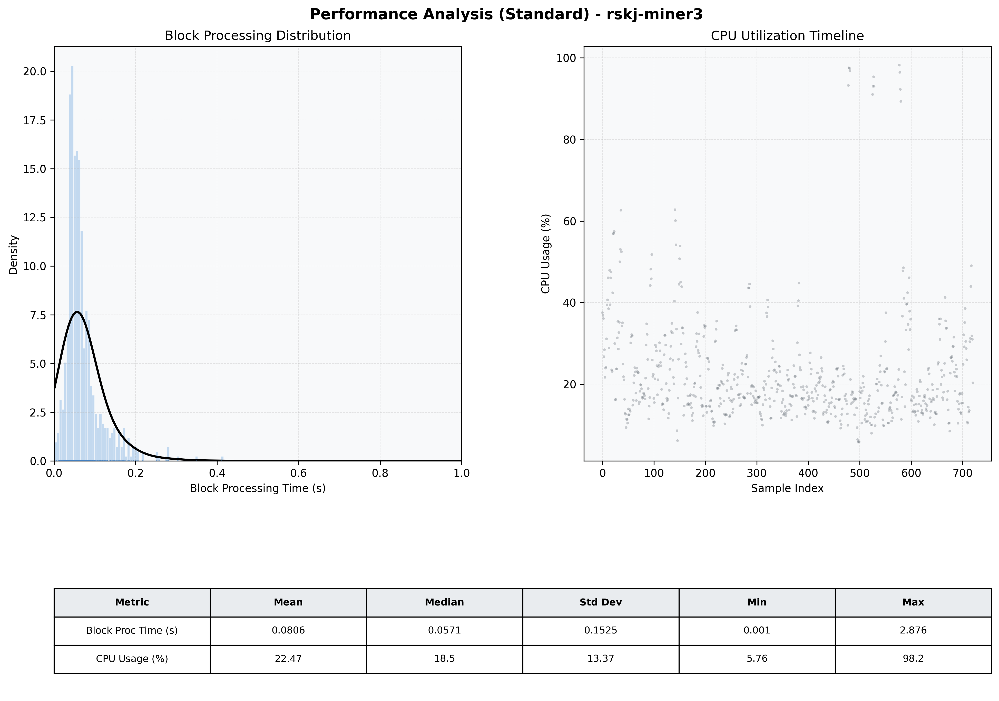

# Miner3 Quantitative Performance Report

| Category | Metric | Unit | Mean | Median | Min | Max |
| :--- | :--- | :--- | :--- | :--- | :--- | :--- |
| Processing | Block Processing Time | s | 0.081 | 0.057 | 0.001 | 2.876 |
|  | BlockExecution JMX | s | 0.045 | 0.034 | 0.002 | 0.399 |
| | Gas Consumed (per block) | M units | 6.33 | 6.89 | 0.00 | 6.97 |
| Resources | CPU Usage per Container | % | 22.47 | 18.54 | 5.76 | 98.23 |
|  | Memory Usage per Container | MiB | 2057.4 | 2082.6 | 1185.1 | 2774.6 |
| JVM | JVM Heap Used | MiB | 931.8 | 925.2 | 94.8 | 1739.0 |
| | JVM Heap Allocated | MiB | 2969.6 | 2969.6 | 2969.6 | 2969.6 |
| JVM GC | GC Copy Time | s | 0.0020 | 0.0017 | 0.000 | 0.010 |
| JVM GC | GC MarkSweep Time | s | 0.0000 | 0.0000 | 0.000 | 0.000 |
| Disk I/O | Disk Read | MiB/s | 0.001 | 0.000 | 0.000 | 0.276 |
|  | Disk Write | MiB/s | 71.129 | 4.552 | 0.000 | 10025.931 |
| Network | Received Network Traffic per Container | KiB/s | 2.89 | 2.43 | 1.18 | 9.51 |
|  | Sent Network Traffic per Container | KiB/s | 11.67 | 11.20 | 9.92 | 17.38 |

