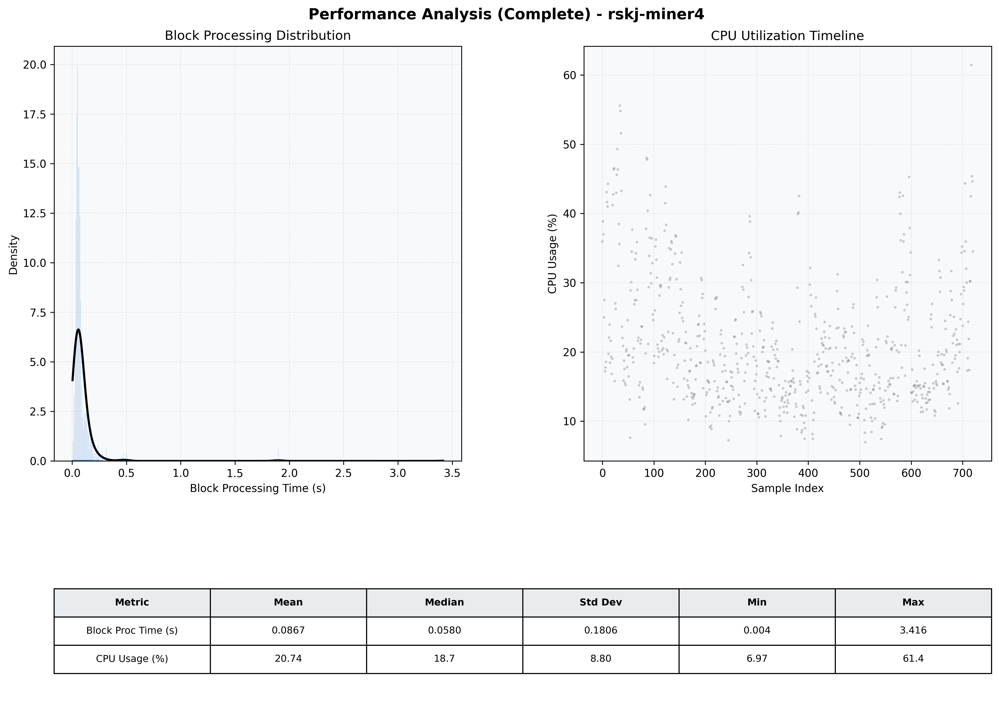

# Miner4 Quantitative Performance Report

| Category | Metric | Unit | Mean | Median | Min | Max |
| :--- | :--- | :--- | :--- | :--- | :--- | :--- |
| Processing | Block Processing Time | s | 0.087 | 0.058 | 0.004 | 3.416 |
|  | BlockExecution JMX | s | 0.059 | 0.032 | 0.006 | 3.260 |
| | Gas Consumed (per block) | M units | 6.33 | 6.89 | 0.00 | 6.97 |
| Resources | CPU Usage per Container | % | 20.74 | 18.69 | 6.97 | 61.43 |
|  | Memory Usage per Container | MiB | 2074.4 | 2088.1 | 1174.6 | 2756.8 |
| JVM | JVM Heap Used | MiB | 934.0 | 923.6 | 81.1 | 1741.0 |
| | JVM Heap Allocated | MiB | 2969.6 | 2969.6 | 2969.6 | 2969.6 |
| JVM GC | GC Copy Time | s | 0.0020 | 0.0016 | 0.000 | 0.009 |
| JVM GC | GC MarkSweep Time | s | 0.0000 | 0.0000 | 0.000 | 0.000 |
| Disk I/O | Disk Read | MiB/s | 0.000 | 0.000 | 0.000 | 0.138 |
|  | Disk Write | MiB/s | 71.099 | 4.415 | 0.000 | 11428.828 |
| Network | Received Network Traffic per Container | KiB/s | 2.91 | 2.44 | 1.21 | 9.05 |
|  | Sent Network Traffic per Container | KiB/s | 11.39 | 11.07 | 9.77 | 16.73 |

