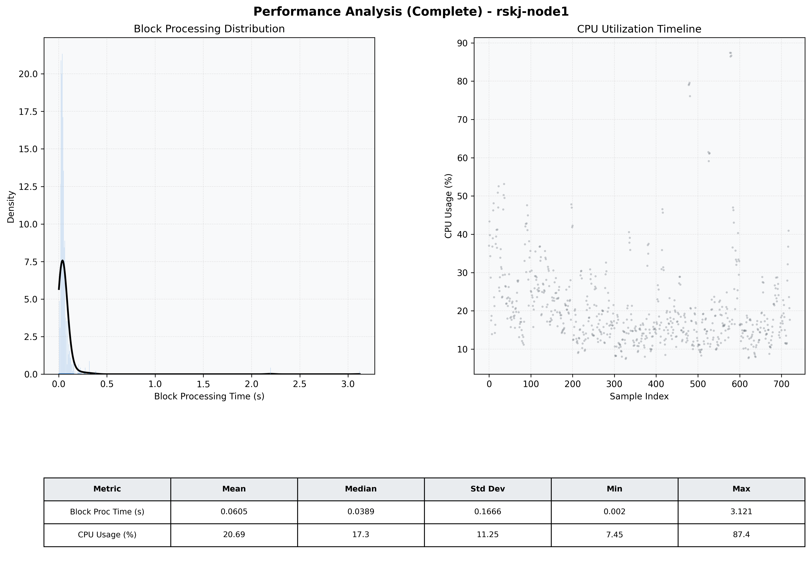

# Node1 Quantitative Performance Report

| Category | Metric | Unit | Mean | Median | Min | Max |
| :--- | :--- | :--- | :--- | :--- | :--- | :--- |
| Processing | Block Processing Time | s | 0.060 | 0.039 | 0.002 | 3.121 |
|  | BlockExecution JMX | s | 0.059 | 0.033 | 0.001 | 2.901 |
| | Gas Consumed (per block) | M units | 6.33 | 6.89 | 0.00 | 6.97 |
| Resources | CPU Usage per Container | % | 20.69 | 17.34 | 7.45 | 87.39 |
|  | Memory Usage per Container | MiB | 2041.5 | 2051.1 | 1202.2 | 2725.8 |
| JVM | JVM Heap Used | MiB | 927.0 | 910.4 | 127.4 | 1711.7 |
| | JVM Heap Allocated | MiB | 2969.6 | 2969.6 | 2969.6 | 2969.6 |
| JVM GC | GC Copy Time | s | 0.0019 | 0.0017 | 0.000 | 0.009 |
| JVM GC | GC MarkSweep Time | s | 0.0000 | 0.0000 | 0.000 | 0.000 |
| Disk I/O | Disk Read | MiB/s | 0.000 | 0.000 | 0.000 | 0.000 |
|  | Disk Write | MiB/s | 67.719 | 1.379 | 0.000 | 11423.724 |
| Network | Received Network Traffic per Container | KiB/s | 2.73 | 2.34 | 1.22 | 8.23 |
|  | Sent Network Traffic per Container | KiB/s | 11.35 | 10.95 | 9.69 | 16.32 |

