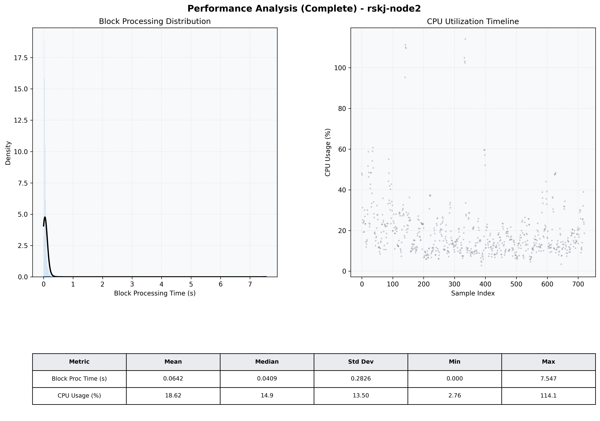

# Node2 Quantitative Performance Report

| Category | Metric | Unit | Mean | Median | Min | Max |
| :--- | :--- | :--- | :--- | :--- | :--- | :--- |
| Processing | Block Processing Time | s | 0.064 | 0.041 | 0.000 | 7.547 |
|  | BlockExecution JMX | s | 0.065 | 0.036 | 0.001 | 7.538 |
| | Gas Consumed (per block) | M units | 6.33 | 6.89 | 0.00 | 6.97 |
| Resources | CPU Usage per Container | % | 18.62 | 14.91 | 2.76 | 114.05 |
|  | Memory Usage per Container | MiB | 2033.6 | 2205.8 | 1168.6 | 2741.8 |
| JVM | JVM Heap Used | MiB | 910.7 | 910.0 | 75.1 | 1750.9 |
| | JVM Heap Allocated | MiB | 2969.6 | 2969.6 | 2969.6 | 2969.6 |
| JVM GC | GC Copy Time | s | 0.0016 | 0.0012 | 0.000 | 0.017 |
| JVM GC | GC MarkSweep Time | s | 0.0000 | 0.0000 | 0.000 | 0.000 |
| Disk I/O | Disk Read | MiB/s | 0.000 | 0.000 | 0.000 | 0.000 |
|  | Disk Write | MiB/s | 29.470 | 1.244 | 0.000 | 5530.949 |
| Network | Received Network Traffic per Container | KiB/s | 2.93 | 2.48 | 1.16 | 9.50 |
|  | Sent Network Traffic per Container | KiB/s | 11.31 | 10.95 | 9.37 | 16.39 |

