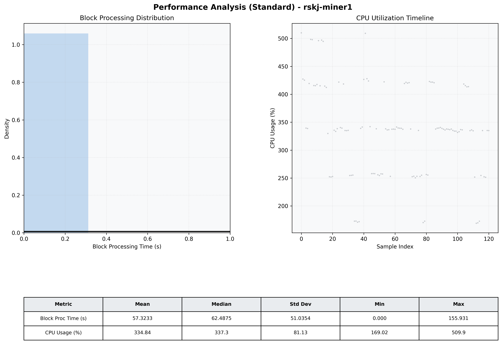

# Miner1 Quantitative Performance Report

| Category | Metric | Unit | Mean | Median | Min | Max |
| :--- | :--- | :--- | :--- | :--- | :--- | :--- |
| Processing | Block Processing Time | s | 57.323 | 62.488 | 0.000 | 155.931 |
|  | BlockExecution JMX | s | 0.002 | 0.002 | 0.002 | 0.002 |
| | Gas Consumed (per block) | M units | 254.15 | 340.11 | 0.00 | 360.00 |
| Resources | CPU Usage per Container | % | 334.84 | 337.32 | 169.02 | 509.94 |
|  | Memory Usage per Container | MiB | 1508.4 | 1501.6 | 1367.0 | 1640.2 |
| JVM | JVM Heap Used | MiB | 653.0 | 658.5 | 137.1 | 1156.8 |
| | JVM Heap Allocated | MiB | 2969.6 | 2969.6 | 2969.6 | 2969.6 |
| JVM GC | GC Copy Time | s | 0.0066 | 0.0065 | 0.005 | 0.010 |
| JVM GC | GC MarkSweep Time | s | 0.0000 | 0.0000 | 0.000 | 0.000 |
| Disk I/O | Disk Read | MiB/s | 0.000 | 0.000 | 0.000 | 0.000 |
|  | Disk Write | MiB/s | 80.742 | 3.034 | 0.000 | 503.689 |
| Network | Received Network Traffic per Container | KiB/s | 20.08 | 2.45 | 1.47 | 107.56 |
|  | Sent Network Traffic per Container | KiB/s | 22.98 | 11.24 | 10.23 | 81.28 |

