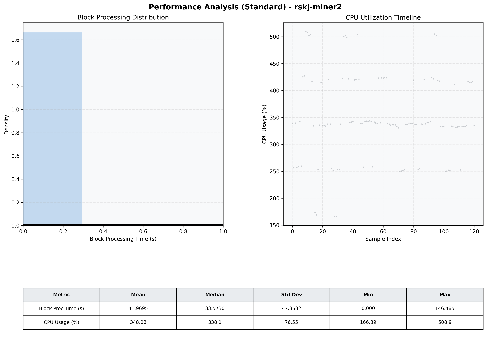

# Miner2 Quantitative Performance Report

| Category | Metric | Unit | Mean | Median | Min | Max |
| :--- | :--- | :--- | :--- | :--- | :--- | :--- |
| Processing | Block Processing Time | s | 41.970 | 33.573 | 0.000 | 146.485 |
|  | BlockExecution JMX | s | 0.007 | 0.007 | 0.007 | 0.007 |
| | Gas Consumed (per block) | M units | 254.15 | 340.11 | 0.00 | 360.00 |
| Resources | CPU Usage per Container | % | 348.08 | 338.10 | 166.39 | 508.95 |
|  | Memory Usage per Container | MiB | 1392.1 | 1391.8 | 1247.6 | 1534.7 |
| JVM | JVM Heap Used | MiB | 568.4 | 540.1 | 124.2 | 1082.9 |
| | JVM Heap Allocated | MiB | 2969.6 | 2969.6 | 2969.6 | 2969.6 |
| JVM GC | GC Copy Time | s | 0.0063 | 0.0061 | 0.005 | 0.011 |
| JVM GC | GC MarkSweep Time | s | 0.0000 | 0.0000 | 0.000 | 0.000 |
| Disk I/O | Disk Read | MiB/s | 0.000 | 0.000 | 0.000 | 0.000 |
|  | Disk Write | MiB/s | 1.802 | 1.379 | 0.000 | 7.586 |
| Network | Received Network Traffic per Container | KiB/s | 1.53 | 1.44 | 1.12 | 4.48 |
|  | Sent Network Traffic per Container | KiB/s | 10.34 | 10.27 | 9.70 | 13.85 |

