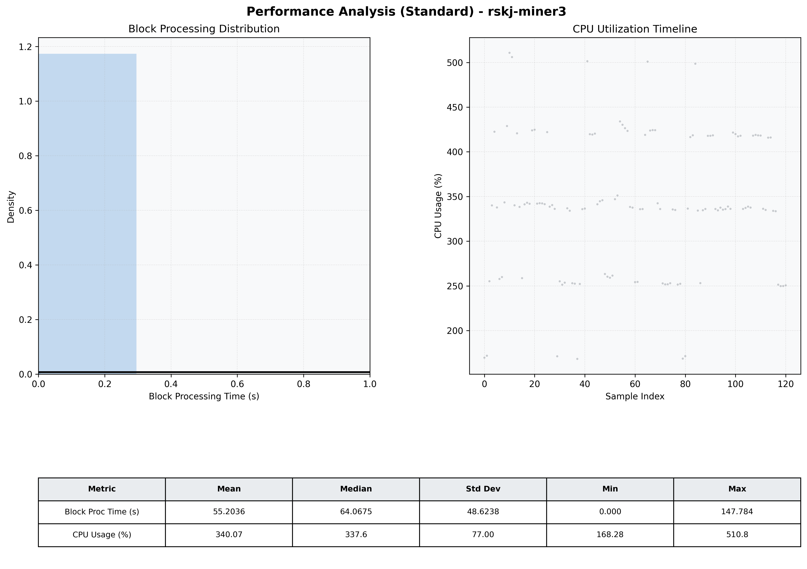

# Miner3 Quantitative Performance Report

| Category | Metric | Unit | Mean | Median | Min | Max |
| :--- | :--- | :--- | :--- | :--- | :--- | :--- |
| Processing | Block Processing Time | s | 55.204 | 64.068 | 0.000 | 147.784 |
|  | BlockExecution JMX | s | 0.003 | 0.003 | 0.001 | 0.004 |
| | Gas Consumed (per block) | M units | 254.15 | 340.11 | 0.00 | 360.00 |
| Resources | CPU Usage per Container | % | 340.07 | 337.60 | 168.28 | 510.76 |
|  | Memory Usage per Container | MiB | 1403.4 | 1408.8 | 1250.3 | 1556.4 |
| JVM | JVM Heap Used | MiB | 602.9 | 636.6 | 163.0 | 1154.2 |
| | JVM Heap Allocated | MiB | 2969.6 | 2969.6 | 2969.6 | 2969.6 |
| JVM GC | GC Copy Time | s | 0.0063 | 0.0061 | 0.005 | 0.011 |
| JVM GC | GC MarkSweep Time | s | 0.0000 | 0.0000 | 0.000 | 0.000 |
| Disk I/O | Disk Read | MiB/s | 0.000 | 0.000 | 0.000 | 0.000 |
|  | Disk Write | MiB/s | 1.836 | 1.517 | 0.000 | 5.794 |
| Network | Received Network Traffic per Container | KiB/s | 1.50 | 1.43 | 1.13 | 4.15 |
|  | Sent Network Traffic per Container | KiB/s | 10.39 | 10.31 | 9.73 | 16.25 |

