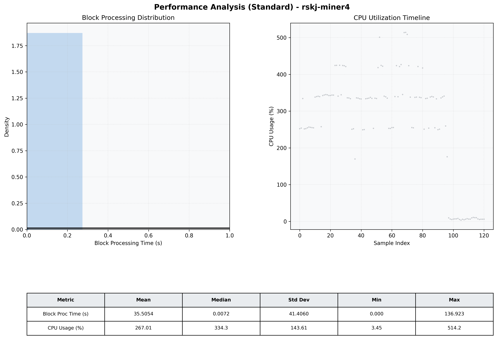

# Miner4 Quantitative Performance Report

| Category | Metric | Unit | Mean | Median | Min | Max |
| :--- | :--- | :--- | :--- | :--- | :--- | :--- |
| Processing | Block Processing Time | s | 35.505 | 0.007 | 0.000 | 136.923 |
|  | BlockExecution JMX | s | 0.003 | 0.003 | 0.002 | 0.011 |
| | Gas Consumed (per block) | M units | 254.15 | 340.11 | 0.00 | 360.00 |
| Resources | CPU Usage per Container | % | 267.01 | 334.32 | 3.45 | 514.15 |
|  | Memory Usage per Container | MiB | 1425.5 | 1446.5 | 1279.1 | 1509.5 |
| JVM | JVM Heap Used | MiB | 589.8 | 586.1 | 89.7 | 1111.8 |
| | JVM Heap Allocated | MiB | 2969.6 | 2969.6 | 2969.6 | 2969.6 |
| JVM GC | GC Copy Time | s | 0.0047 | 0.0054 | 0.000 | 0.010 |
| JVM GC | GC MarkSweep Time | s | 0.0000 | 0.0000 | 0.000 | 0.000 |
| Disk I/O | Disk Read | MiB/s | 0.000 | 0.000 | 0.000 | 0.000 |
|  | Disk Write | MiB/s | 1.835 | 1.655 | 0.552 | 6.207 |
| Network | Received Network Traffic per Container | KiB/s | 1.50 | 1.40 | 1.13 | 4.09 |
|  | Sent Network Traffic per Container | KiB/s | 10.46 | 10.31 | 9.67 | 14.03 |

