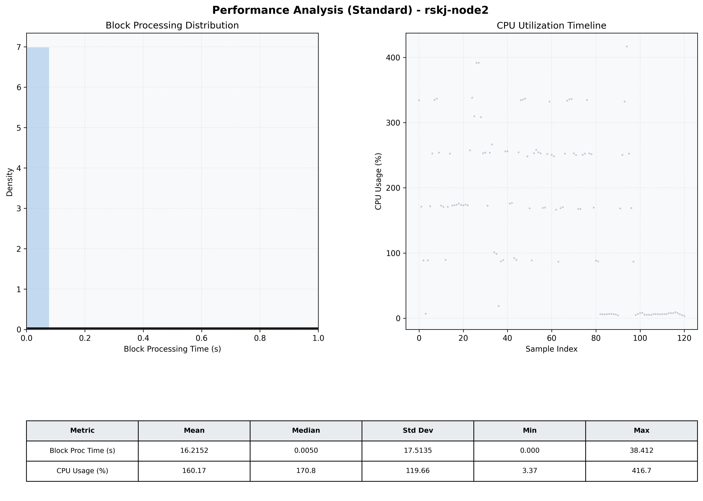

# Node2 Quantitative Performance Report

| Category | Metric | Unit | Mean | Median | Min | Max |
| :--- | :--- | :--- | :--- | :--- | :--- | :--- |
| Processing | Block Processing Time | s | 16.215 | 0.005 | 0.000 | 38.412 |
|  | BlockExecution JMX | s | 0.002 | 0.002 | 0.001 | 0.006 |
| | Gas Consumed (per block) | M units | 254.15 | 340.11 | 0.00 | 360.00 |
| Resources | CPU Usage per Container | % | 160.17 | 170.84 | 3.37 | 416.74 |
|  | Memory Usage per Container | MiB | 1256.9 | 1260.1 | 1198.4 | 1289.7 |
| JVM | JVM Heap Used | MiB | 509.5 | 528.5 | 75.4 | 952.7 |
| | JVM Heap Allocated | MiB | 2969.6 | 2969.6 | 2969.6 | 2969.6 |
| JVM GC | GC Copy Time | s | 0.0021 | 0.0021 | 0.000 | 0.006 |
| JVM GC | GC MarkSweep Time | s | 0.0000 | 0.0000 | 0.000 | 0.000 |
| Disk I/O | Disk Read | MiB/s | 0.000 | 0.000 | 0.000 | 0.000 |
|  | Disk Write | MiB/s | 1.002 | 0.966 | 0.000 | 2.345 |
| Network | Received Network Traffic per Container | KiB/s | 1.56 | 1.48 | 1.16 | 4.03 |
|  | Sent Network Traffic per Container | KiB/s | 10.29 | 10.24 | 9.60 | 13.07 |

