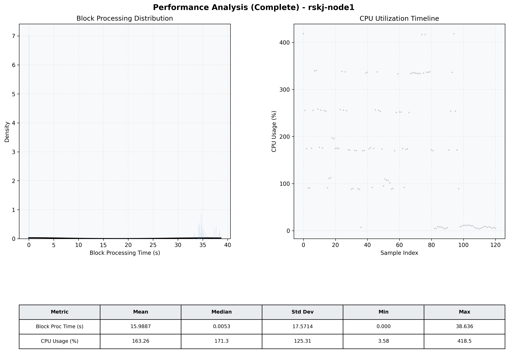

# Node1 Quantitative Performance Report

| Category | Metric | Unit | Mean | Median | Min | Max |
| :--- | :--- | :--- | :--- | :--- | :--- | :--- |
| Processing | Block Processing Time | s | 15.989 | 0.005 | 0.000 | 38.636 |
|  | BlockExecution JMX | s | 22.362 | 34.077 | 0.001 | 38.630 |
| | Gas Consumed (per block) | M units | 254.15 | 340.11 | 0.00 | 360.00 |
| Resources | CPU Usage per Container | % | 163.26 | 171.29 | 3.58 | 418.50 |
|  | Memory Usage per Container | MiB | 1281.0 | 1282.8 | 1221.2 | 1314.1 |
| JVM | JVM Heap Used | MiB | 503.6 | 505.7 | 83.3 | 948.3 |
| | JVM Heap Allocated | MiB | 2969.6 | 2969.6 | 2969.6 | 2969.6 |
| JVM GC | GC Copy Time | s | 0.0022 | 0.0022 | 0.000 | 0.007 |
| JVM GC | GC MarkSweep Time | s | 0.0000 | 0.0000 | 0.000 | 0.000 |
| Disk I/O | Disk Read | MiB/s | 0.000 | 0.000 | 0.000 | 0.000 |
|  | Disk Write | MiB/s | 1.002 | 0.966 | 0.000 | 2.069 |
| Network | Received Network Traffic per Container | KiB/s | 1.56 | 1.48 | 1.16 | 3.93 |
|  | Sent Network Traffic per Container | KiB/s | 10.30 | 10.27 | 9.68 | 12.08 |

