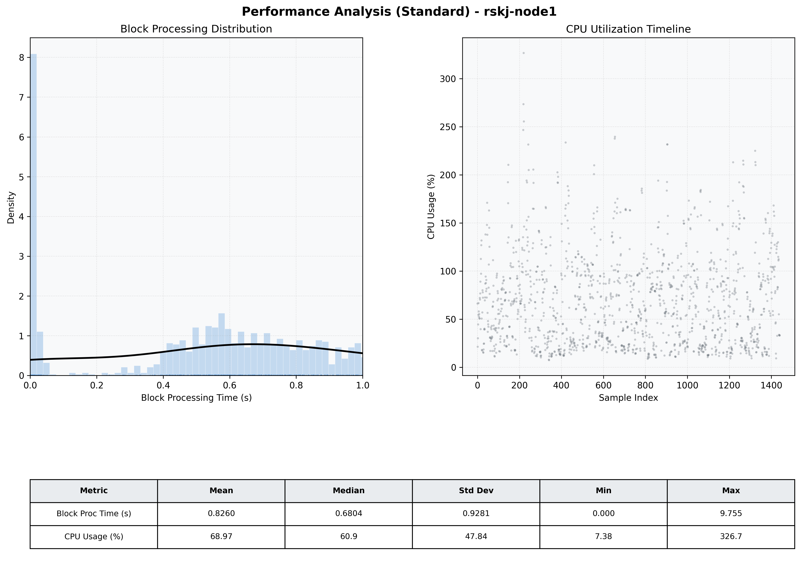

# Node1 Quantitative Performance Report

| Category | Metric | Unit | Mean | Median | Min | Max |
| :--- | :--- | :--- | :--- | :--- | :--- | :--- |
| Processing | Block Processing Time | s | 0.826 | 0.680 | 0.000 | 9.755 |
|  | BlockExecution JMX | s | 0.542 | 0.591 | 0.002 | 1.000 |
| | Gas Consumed (per block) | M units | 65.75 | 79.05 | 0.00 | 79.81 |
| Resources | CPU Usage per Container | % | 68.97 | 60.86 | 7.38 | 326.71 |
|  | Memory Usage per Container | MiB | 3616.1 | 3621.8 | 3000.6 | 4096.0 |
| JVM | JVM Heap Used | MiB | 1672.2 | 1695.0 | 446.0 | 2893.3 |
| | JVM Heap Allocated | MiB | 2969.6 | 2969.6 | 2969.6 | 2969.6 |
| JVM GC | GC Copy Time | s | 0.0111 | 0.0088 | 0.000 | 0.088 |
| JVM GC | GC MarkSweep Time | s | 0.0022 | 0.0000 | 0.000 | 0.270 |
| Disk I/O | Disk Read | MiB/s | 0.001 | 0.000 | 0.000 | 0.098 |
|  | Disk Write | MiB/s | 0.001 | 0.000 | 0.000 | 0.112 |
| Network | Received Network Traffic per Container | KiB/s | 2.13 | 1.84 | 0.00 | 7.32 |
|  | Sent Network Traffic per Container | KiB/s | 9.47 | 10.40 | 0.00 | 14.90 |

