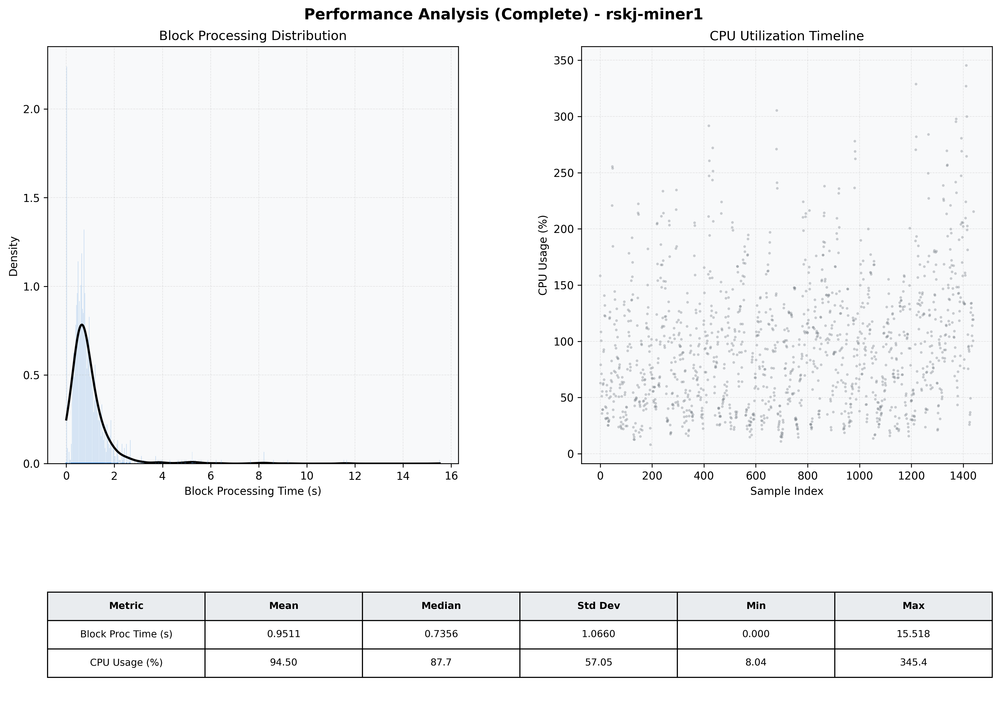

# Miner1 Quantitative Performance Report

| Category | Metric | Unit | Mean | Median | Min | Max |
| :--- | :--- | :--- | :--- | :--- | :--- | :--- |
| Processing | Block Processing Time | s | 0.951 | 0.736 | 0.000 | 15.518 |
|  | BlockExecution JMX | s | 0.650 | 0.464 | 0.002 | 13.079 |
| | Gas Consumed (per block) | M units | 65.75 | 79.05 | 0.00 | 79.81 |
| Resources | CPU Usage per Container | % | 94.50 | 87.72 | 8.04 | 345.36 |
|  | Memory Usage per Container | MiB | 3746.9 | 3755.9 | 3080.9 | 4096.0 |
| JVM | JVM Heap Used | MiB | 1655.5 | 1669.8 | 381.2 | 2849.9 |
| | JVM Heap Allocated | MiB | 2969.6 | 2969.6 | 2969.6 | 2969.6 |
| JVM GC | GC Copy Time | s | 0.0158 | 0.0132 | 0.001 | 0.157 |
| JVM GC | GC MarkSweep Time | s | 0.0016 | 0.0000 | 0.000 | 0.457 |
| Disk I/O | Disk Read | MiB/s | 0.001 | 0.000 | 0.000 | 0.098 |
|  | Disk Write | MiB/s | 0.002 | 0.000 | 0.000 | 0.110 |
| Network | Received Network Traffic per Container | KiB/s | 19.07 | 10.85 | 0.00 | 68.28 |
|  | Sent Network Traffic per Container | KiB/s | 23.43 | 18.04 | 0.00 | 66.05 |

