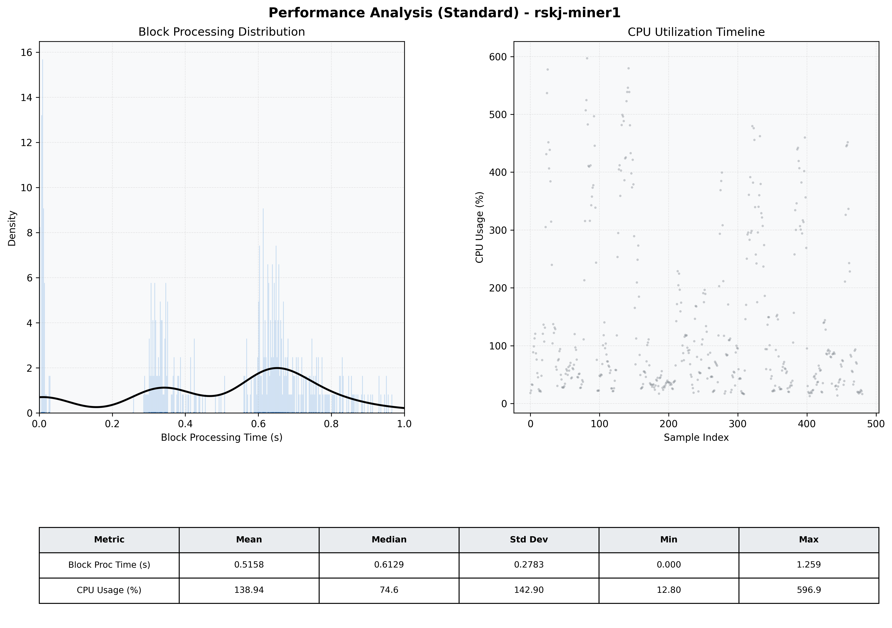

# Miner1 Quantitative Performance Report

| Category | Metric | Unit | Mean | Median | Min | Max |
| :--- | :--- | :--- | :--- | :--- | :--- | :--- |
| Processing | Block Processing Time | s | 0.516 | 0.613 | 0.000 | 1.259 |
|  | BlockExecution JMX | s | 0.336 | 0.330 | 0.003 | 0.908 |
| | Gas Consumed (per block) | M units | 8.68 | 10.00 | 0.00 | 10.00 |
| JVM | JVM Heap Used | MiB | 1685.0 | 1709.7 | 86.5 | 3164.4 |
| | JVM Heap Allocated | MiB | 5120.0 | 5120.0 | 5120.0 | 5120.0 |
| JVM GC | GC Copy Time | s | N/A | N/A | N/A | N/A |
| JVM GC | GC MarkSweep Time | s | N/A | N/A | N/A | N/A |
| Disk I/O | Disk Read | MiB/s | 0.020 | 0.000 | 0.000 | 6.483 |
|  | Disk Write | MiB/s | 875.076 | 654.576 | 0.000 | 3677.219 |
| Network | Received Network Traffic per Container | KiB/s | 2.54 | 2.15 | 1.47 | 5.82 |
|  | Sent Network Traffic per Container | KiB/s | 10.75 | 10.39 | 9.35 | 16.76 |
| Resources | CPU Usage per Container | % | 138.94 | 74.60 | 12.80 | 596.86 |
|  | Memory Usage per Container | MiB | 4279.5 | 4278.1 | 4069.7 | 4476.4 |
| | CPU & Memory Assigned | - | 4.0 CPU, 8G | - | - | - |
| | MALLOC_ARENA_MAX | - | N/A | - | - | - |

