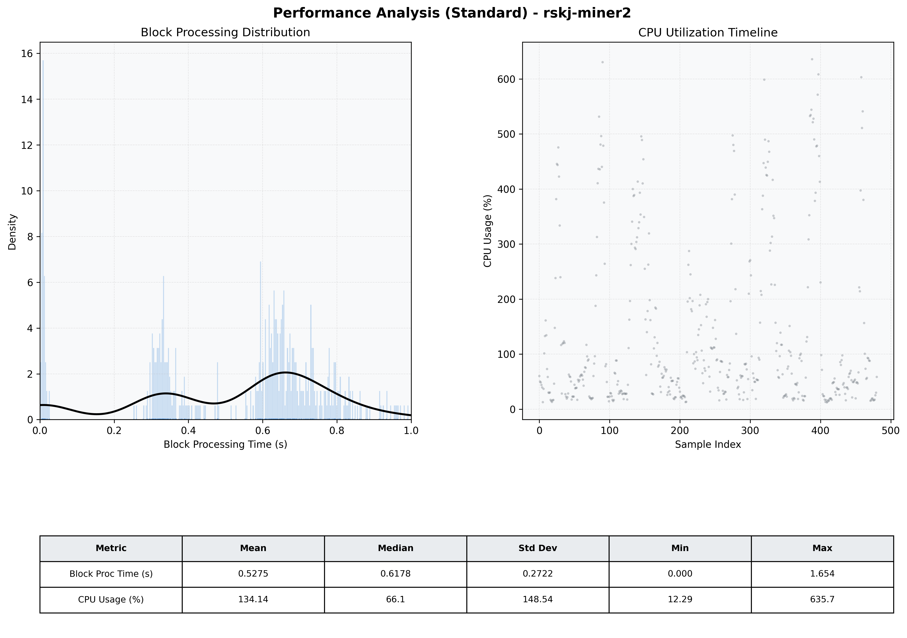

# Miner2 Quantitative Performance Report

| Category | Metric | Unit | Mean | Median | Min | Max |
| :--- | :--- | :--- | :--- | :--- | :--- | :--- |
| Processing | Block Processing Time | s | 0.527 | 0.618 | 0.000 | 1.654 |
|  | BlockExecution JMX | s | 0.339 | 0.334 | 0.003 | 0.628 |
| | Gas Consumed (per block) | M units | 8.68 | 10.00 | 0.00 | 10.00 |
| JVM | JVM Heap Used | MiB | 1625.7 | 1600.3 | 120.8 | 3131.4 |
| | JVM Heap Allocated | MiB | 5120.0 | 5120.0 | 5120.0 | 5120.0 |
| JVM GC | GC Copy Time | s | N/A | N/A | N/A | N/A |
| JVM GC | GC MarkSweep Time | s | N/A | N/A | N/A | N/A |
| Disk I/O | Disk Read | MiB/s | 0.008 | 0.000 | 0.000 | 1.655 |
|  | Disk Write | MiB/s | 914.561 | 679.425 | 0.000 | 3604.841 |
| Network | Received Network Traffic per Container | KiB/s | 2.74 | 2.22 | 1.36 | 7.53 |
|  | Sent Network Traffic per Container | KiB/s | 11.26 | 10.62 | 9.34 | 18.17 |
| Resources | CPU Usage per Container | % | 134.14 | 66.10 | 12.29 | 635.75 |
|  | Memory Usage per Container | MiB | 4292.3 | 4293.6 | 4058.0 | 4484.4 |
| | CPU & Memory Assigned | - | 4.0 CPU, 8G | - | - | - |
| | MALLOC_ARENA_MAX | - | N/A | - | - | - |

