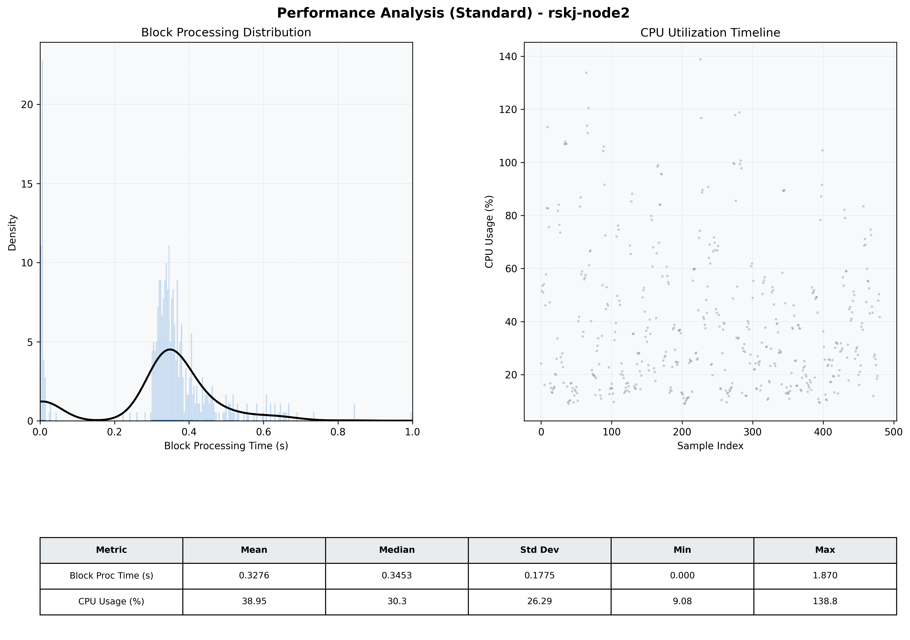

# Node2 Quantitative Performance Report

| Category | Metric | Unit | Mean | Median | Min | Max |
| :--- | :--- | :--- | :--- | :--- | :--- | :--- |
| Processing | Block Processing Time | s | 0.328 | 0.345 | 0.000 | 1.870 |
|  | BlockExecution JMX | s | 0.330 | 0.341 | 0.002 | 0.973 |
| | Gas Consumed (per block) | M units | 8.68 | 10.00 | 0.00 | 10.00 |
| JVM | JVM Heap Used | MiB | 961.8 | 966.7 | 51.3 | 1897.4 |
| | JVM Heap Allocated | MiB | 4096.0 | 4096.0 | 4096.0 | 4096.0 |
| JVM GC | GC Copy Time | s | N/A | N/A | N/A | N/A |
| JVM GC | GC MarkSweep Time | s | N/A | N/A | N/A | N/A |
| Disk I/O | Disk Read | MiB/s | 0.005 | 0.000 | 0.000 | 0.828 |
|  | Disk Write | MiB/s | 116.011 | 117.241 | 0.000 | 401.779 |
| Network | Received Network Traffic per Container | KiB/s | 2.73 | 2.22 | 1.35 | 7.36 |
|  | Sent Network Traffic per Container | KiB/s | 10.39 | 10.12 | 9.15 | 13.21 |
| Resources | CPU Usage per Container | % | 38.95 | 30.35 | 9.08 | 138.78 |
|  | Memory Usage per Container | MiB | 2527.0 | 2527.1 | 2425.4 | 2634.1 |
| | CPU & Memory Assigned | - | 2.0 CPU, 6G | - | - | - |
| | MALLOC_ARENA_MAX | - | N/A | - | - | - |

