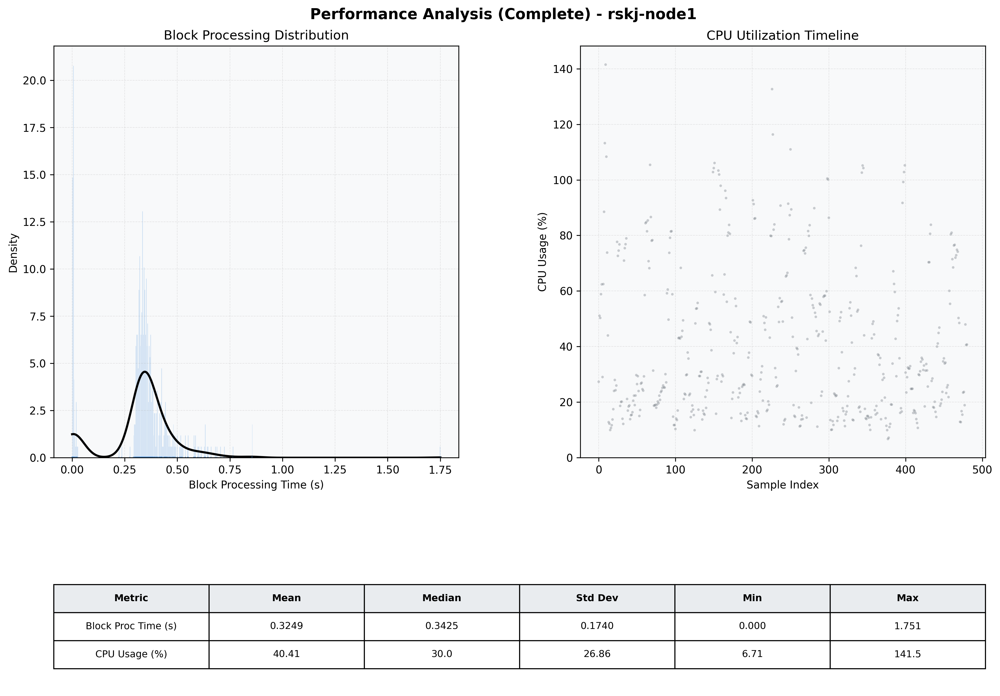

# Node1 Quantitative Performance Report

| Category | Metric | Unit | Mean | Median | Min | Max |
| :--- | :--- | :--- | :--- | :--- | :--- | :--- |
| Processing | Block Processing Time | s | 0.325 | 0.342 | 0.000 | 1.751 |
|  | BlockExecution JMX | s | 0.332 | 0.340 | 0.002 | 1.251 |
| | Gas Consumed (per block) | M units | 8.68 | 10.00 | 0.00 | 10.00 |
| JVM | JVM Heap Used | MiB | 989.9 | 977.8 | 65.4 | 1911.3 |
| | JVM Heap Allocated | MiB | 4096.0 | 4096.0 | 4096.0 | 4096.0 |
| JVM GC | GC Copy Time | s | N/A | N/A | N/A | N/A |
| JVM GC | GC MarkSweep Time | s | N/A | N/A | N/A | N/A |
| Disk I/O | Disk Read | MiB/s | 0.004 | 0.000 | 0.000 | 0.828 |
|  | Disk Write | MiB/s | 117.026 | 117.659 | 0.000 | 402.883 |
| Network | Received Network Traffic per Container | KiB/s | 3.02 | 2.42 | 1.35 | 9.31 |
|  | Sent Network Traffic per Container | KiB/s | 10.89 | 10.33 | 9.38 | 16.22 |
| Resources | CPU Usage per Container | % | 40.41 | 30.05 | 6.71 | 141.50 |
|  | Memory Usage per Container | MiB | 2609.1 | 2609.4 | 2507.5 | 2710.6 |
| | CPU & Memory Assigned | - | 2.0 CPU, 6G | - | - | - |
| | MALLOC_ARENA_MAX | - | N/A | - | - | - |

