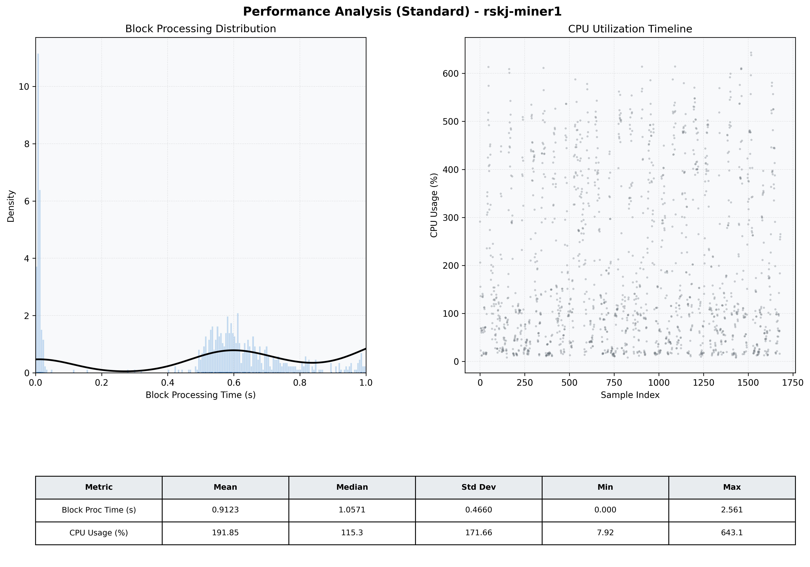

# Miner1 Quantitative Performance Report

| Category | Metric | Unit | Mean | Median | Min | Max |
| :--- | :--- | :--- | :--- | :--- | :--- | :--- |
| Processing | Block Processing Time | s | 0.912 | 1.057 | 0.000 | 2.561 |
|  | BlockExecution JMX | s | 0.577 | 0.584 | 0.003 | 0.994 |
| | Gas Consumed (per block) | M units | 14.76 | 17.00 | 0.00 | 17.00 |
| JVM | JVM Heap Used | MiB | 1693.8 | 1679.2 | 105.3 | 3262.7 |
| | JVM Heap Allocated | MiB | 5120.0 | 5120.0 | 5120.0 | 5120.0 |
| JVM GC | GC Copy Time | s | N/A | N/A | N/A | N/A |
| JVM GC | GC MarkSweep Time | s | N/A | N/A | N/A | N/A |
| Disk I/O | Disk Read | MiB/s | 0.001 | 0.000 | 0.000 | 0.828 |
|  | Disk Write | MiB/s | 0.001 | 0.001 | 0.000 | 0.005 |
| Network | Received Network Traffic per Container | KiB/s | 2.57 | 2.15 | 1.45 | 6.33 |
|  | Sent Network Traffic per Container | KiB/s | 10.74 | 10.37 | 9.36 | 16.47 |
| Resources | CPU Usage per Container | % | 191.85 | 115.31 | 7.92 | 643.13 |
|  | Memory Usage per Container | MiB | 4831.1 | 4790.5 | 4220.1 | 5477.9 |
| | CPU & Memory Assigned | - | 4.0 CPU, 8G | - | - | - |
| | MALLOC_ARENA_MAX | - | N/A | - | - | - |

