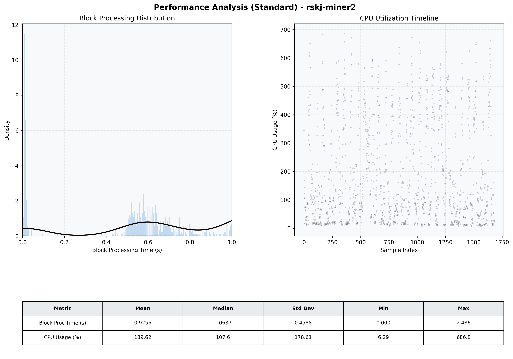

# Miner2 Quantitative Performance Report

| Category | Metric | Unit | Mean | Median | Min | Max |
| :--- | :--- | :--- | :--- | :--- | :--- | :--- |
| Processing | Block Processing Time | s | 0.926 | 1.064 | 0.000 | 2.486 |
|  | BlockExecution JMX | s | 0.574 | 0.574 | 0.003 | 0.999 |
| | Gas Consumed (per block) | M units | 14.76 | 17.00 | 0.00 | 17.00 |
| JVM | JVM Heap Used | MiB | 1672.1 | 1704.1 | 90.9 | 3276.4 |
| | JVM Heap Allocated | MiB | 5120.0 | 5120.0 | 5120.0 | 5120.0 |
| JVM GC | GC Copy Time | s | N/A | N/A | N/A | N/A |
| JVM GC | GC MarkSweep Time | s | N/A | N/A | N/A | N/A |
| Disk I/O | Disk Read | MiB/s | 0.005 | 0.000 | 0.000 | 3.310 |
|  | Disk Write | MiB/s | 0.001 | 0.001 | 0.000 | 0.005 |
| Network | Received Network Traffic per Container | KiB/s | 2.81 | 2.26 | 1.41 | 7.78 |
|  | Sent Network Traffic per Container | KiB/s | 11.34 | 10.66 | 9.03 | 19.23 |
| Resources | CPU Usage per Container | % | 189.62 | 107.64 | 6.29 | 686.82 |
|  | Memory Usage per Container | MiB | 4822.3 | 4860.8 | 4220.6 | 5430.9 |
| | CPU & Memory Assigned | - | 4.0 CPU, 8G | - | - | - |
| | MALLOC_ARENA_MAX | - | N/A | - | - | - |

