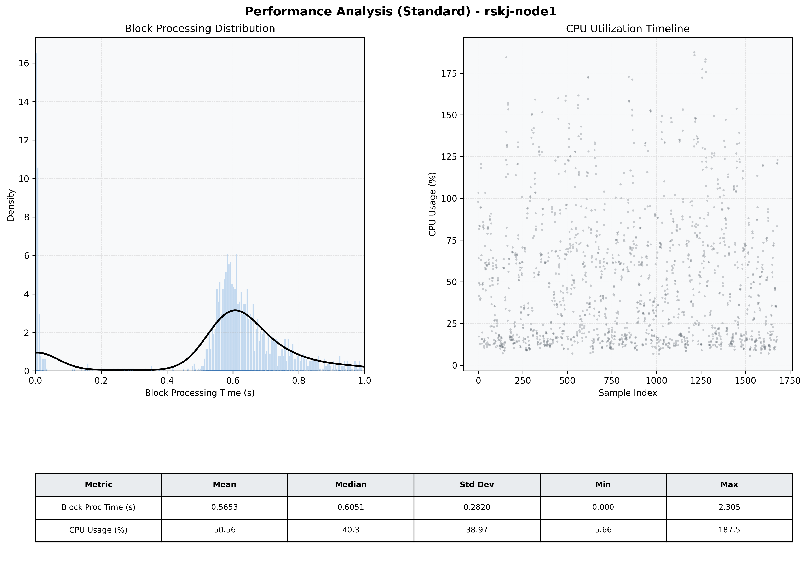

# Node1 Quantitative Performance Report

| Category | Metric | Unit | Mean | Median | Min | Max |
| :--- | :--- | :--- | :--- | :--- | :--- | :--- |
| Processing | Block Processing Time | s | 0.565 | 0.605 | 0.000 | 2.305 |
|  | BlockExecution JMX | s | 0.565 | 0.598 | 0.002 | 0.996 |
| | Gas Consumed (per block) | M units | 14.76 | 17.00 | 0.00 | 17.00 |
| JVM | JVM Heap Used | MiB | 1048.8 | 1045.6 | 75.5 | 2001.2 |
| | JVM Heap Allocated | MiB | 4096.0 | 4096.0 | 4096.0 | 4096.0 |
| JVM GC | GC Copy Time | s | N/A | N/A | N/A | N/A |
| JVM GC | GC MarkSweep Time | s | N/A | N/A | N/A | N/A |
| Disk I/O | Disk Read | MiB/s | 0.002 | 0.000 | 0.000 | 0.828 |
|  | Disk Write | MiB/s | 201.517 | 200.276 | 0.000 | 1000.414 |
| Network | Received Network Traffic per Container | KiB/s | 2.94 | 2.36 | 1.42 | 7.94 |
|  | Sent Network Traffic per Container | KiB/s | 10.85 | 10.37 | 9.04 | 15.96 |
| Resources | CPU Usage per Container | % | 50.56 | 40.28 | 5.66 | 187.49 |
|  | Memory Usage per Container | MiB | 2763.4 | 2773.7 | 2550.8 | 2941.0 |
| | CPU & Memory Assigned | - | 2.0 CPU, 6G | - | - | - |
| | MALLOC_ARENA_MAX | - | N/A | - | - | - |

