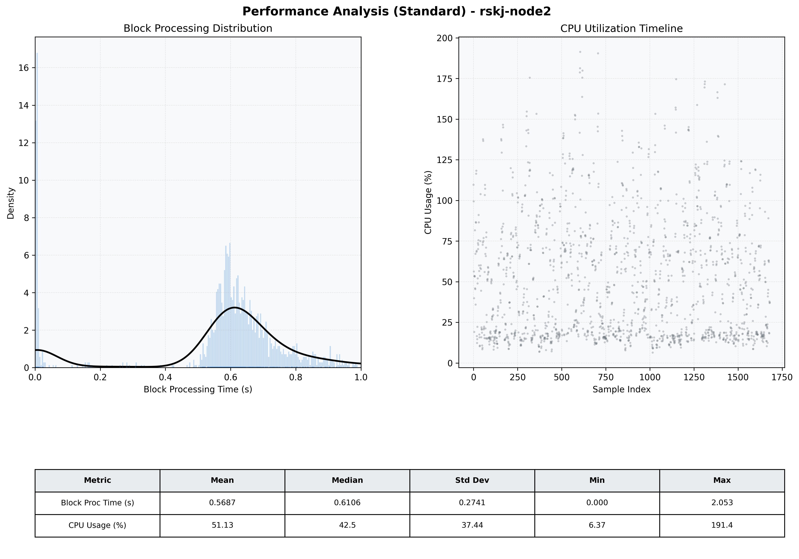

# Node2 Quantitative Performance Report

| Category | Metric | Unit | Mean | Median | Min | Max |
| :--- | :--- | :--- | :--- | :--- | :--- | :--- |
| Processing | Block Processing Time | s | 0.569 | 0.611 | 0.000 | 2.053 |
|  | BlockExecution JMX | s | 0.568 | 0.603 | 0.002 | 0.996 |
| | Gas Consumed (per block) | M units | 14.76 | 17.00 | 0.00 | 17.00 |
| JVM | JVM Heap Used | MiB | 1039.0 | 1031.7 | 68.8 | 1997.3 |
| | JVM Heap Allocated | MiB | 4096.0 | 4096.0 | 4096.0 | 4096.0 |
| JVM GC | GC Copy Time | s | N/A | N/A | N/A | N/A |
| JVM GC | GC MarkSweep Time | s | N/A | N/A | N/A | N/A |
| Disk I/O | Disk Read | MiB/s | 0.002 | 0.000 | 0.000 | 0.828 |
|  | Disk Write | MiB/s | 201.331 | 199.862 | 0.000 | 801.241 |
| Network | Received Network Traffic per Container | KiB/s | 2.70 | 2.25 | 1.40 | 6.69 |
|  | Sent Network Traffic per Container | KiB/s | 10.42 | 10.15 | 9.30 | 14.09 |
| Resources | CPU Usage per Container | % | 51.13 | 42.52 | 6.37 | 191.36 |
|  | Memory Usage per Container | MiB | 2749.9 | 2760.9 | 2537.6 | 2930.8 |
| | CPU & Memory Assigned | - | 2.0 CPU, 6G | - | - | - |
| | MALLOC_ARENA_MAX | - | N/A | - | - | - |

