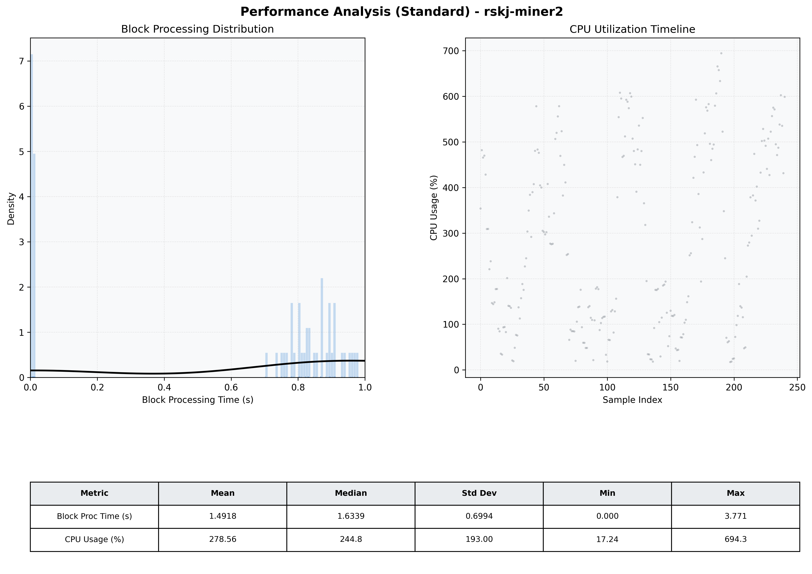

# Miner2 Quantitative Performance Report

| Category | Metric | Unit | Mean | Median | Min | Max |
| :--- | :--- | :--- | :--- | :--- | :--- | :--- |
| Processing | Block Processing Time | s | 1.492 | 1.634 | 0.000 | 3.771 |
|  | BlockExecution JMX | s | 0.780 | 0.859 | 0.002 | 0.996 |
| | Gas Consumed (per block) | M units | 22.76 | 25.00 | 0.00 | 25.00 |
| JVM | JVM Heap Used | MiB | 1675.1 | 1686.9 | 100.1 | 3136.5 |
| | JVM Heap Allocated | MiB | 5120.0 | 5120.0 | 5120.0 | 5120.0 |
| JVM GC | GC Copy Time | s | N/A | N/A | N/A | N/A |
| JVM GC | GC MarkSweep Time | s | N/A | N/A | N/A | N/A |
| Disk I/O | Disk Read | MiB/s | 0.009 | 0.000 | 0.000 | 0.690 |
|  | Disk Write | MiB/s | 0.002 | 0.001 | 0.000 | 0.005 |
| Network | Received Network Traffic per Container | KiB/s | 2.80 | 2.29 | 1.49 | 6.87 |
|  | Sent Network Traffic per Container | KiB/s | 11.32 | 10.61 | 9.60 | 18.29 |
| Resources | CPU Usage per Container | % | 278.56 | 244.81 | 17.24 | 694.32 |
|  | Memory Usage per Container | MiB | 4332.7 | 4328.2 | 4210.6 | 4471.4 |
| | CPU & Memory Assigned | - | 4.0 CPU, 8G | - | - | - |
| | MALLOC_ARENA_MAX | - | N/A | - | - | - |

