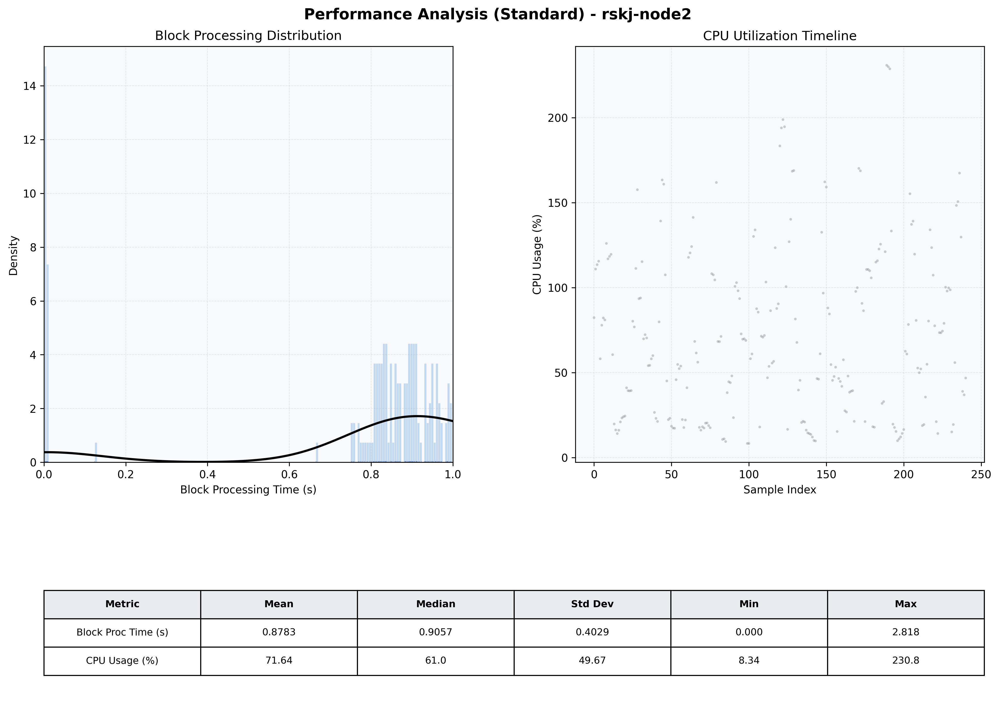

# Node2 Quantitative Performance Report

| Category | Metric | Unit | Mean | Median | Min | Max |
| :--- | :--- | :--- | :--- | :--- | :--- | :--- |
| Processing | Block Processing Time | s | 0.878 | 0.906 | 0.000 | 2.818 |
|  | BlockExecution JMX | s | 0.770 | 0.860 | 0.002 | 0.999 |
| | Gas Consumed (per block) | M units | 22.76 | 25.00 | 0.00 | 25.00 |
| JVM | JVM Heap Used | MiB | 953.1 | 915.9 | 57.5 | 1890.1 |
| | JVM Heap Allocated | MiB | 4096.0 | 4096.0 | 4096.0 | 4096.0 |
| JVM GC | GC Copy Time | s | N/A | N/A | N/A | N/A |
| JVM GC | GC MarkSweep Time | s | N/A | N/A | N/A | N/A |
| Disk I/O | Disk Read | MiB/s | 0.007 | 0.000 | 0.000 | 0.828 |
|  | Disk Write | MiB/s | 307.256 | 294.570 | 0.000 | 881.746 |
| Network | Received Network Traffic per Container | KiB/s | 2.77 | 2.26 | 1.52 | 7.35 |
|  | Sent Network Traffic per Container | KiB/s | 10.40 | 10.13 | 9.44 | 12.61 |
| Resources | CPU Usage per Container | % | 71.64 | 60.97 | 8.34 | 230.82 |
|  | Memory Usage per Container | MiB | 2570.1 | 2569.1 | 2502.8 | 2638.2 |
| | CPU & Memory Assigned | - | 2.0 CPU, 6G | - | - | - |
| | MALLOC_ARENA_MAX | - | N/A | - | - | - |

