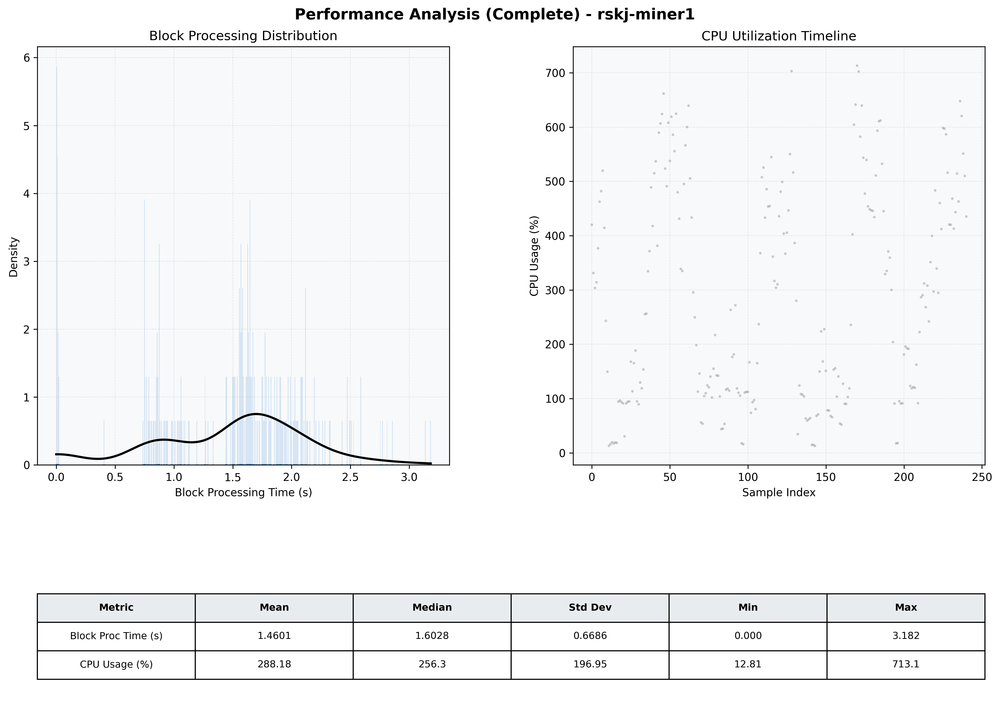

# Miner1 Quantitative Performance Report

| Category | Metric | Unit | Mean | Median | Min | Max |
| :--- | :--- | :--- | :--- | :--- | :--- | :--- |
| Processing | Block Processing Time | s | 1.460 | 1.603 | 0.000 | 3.182 |
|  | BlockExecution JMX | s | 0.879 | 0.848 | 0.004 | 1.555 |
| | Gas Consumed (per block) | M units | 22.76 | 25.00 | 0.00 | 25.00 |
| JVM | JVM Heap Used | MiB | 1697.5 | 1778.9 | 87.2 | 3151.9 |
| | JVM Heap Allocated | MiB | 5120.0 | 5120.0 | 5120.0 | 5120.0 |
| JVM GC | GC Copy Time | s | N/A | N/A | N/A | N/A |
| JVM GC | GC MarkSweep Time | s | N/A | N/A | N/A | N/A |
| Disk I/O | Disk Read | MiB/s | 0.010 | 0.000 | 0.000 | 0.690 |
|  | Disk Write | MiB/s | 0.002 | 0.001 | 0.000 | 0.005 |
| Network | Received Network Traffic per Container | KiB/s | 2.55 | 2.12 | 1.46 | 5.77 |
|  | Sent Network Traffic per Container | KiB/s | 10.79 | 10.36 | 9.63 | 14.60 |
| Resources | CPU Usage per Container | % | 288.18 | 256.32 | 12.81 | 713.07 |
|  | Memory Usage per Container | MiB | 4280.2 | 4280.5 | 4163.6 | 4400.5 |
| | CPU & Memory Assigned | - | 4.0 CPU, 8G | - | - | - |
| | MALLOC_ARENA_MAX | - | N/A | - | - | - |

