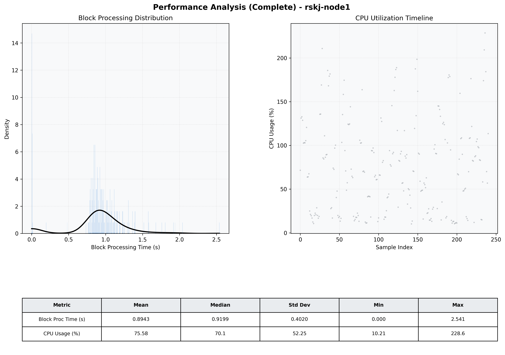

# Node1 Quantitative Performance Report

| Category | Metric | Unit | Mean | Median | Min | Max |
| :--- | :--- | :--- | :--- | :--- | :--- | :--- |
| Processing | Block Processing Time | s | 0.894 | 0.920 | 0.000 | 2.541 |
|  | BlockExecution JMX | s | 0.927 | 0.922 | 0.002 | 2.527 |
| | Gas Consumed (per block) | M units | 22.76 | 25.00 | 0.00 | 25.00 |
| JVM | JVM Heap Used | MiB | 964.1 | 959.1 | 64.6 | 1883.3 |
| | JVM Heap Allocated | MiB | 4096.0 | 4096.0 | 4096.0 | 4096.0 |
| JVM GC | GC Copy Time | s | N/A | N/A | N/A | N/A |
| JVM GC | GC MarkSweep Time | s | N/A | N/A | N/A | N/A |
| Disk I/O | Disk Read | MiB/s | 0.005 | 0.000 | 0.000 | 0.690 |
|  | Disk Write | MiB/s | 308.173 | 294.503 | 0.000 | 882.160 |
| Network | Received Network Traffic per Container | KiB/s | 2.90 | 2.29 | 1.55 | 7.47 |
|  | Sent Network Traffic per Container | KiB/s | 10.83 | 10.33 | 9.46 | 15.09 |
| Resources | CPU Usage per Container | % | 75.58 | 70.15 | 10.21 | 228.59 |
|  | Memory Usage per Container | MiB | 2645.1 | 2643.8 | 2576.1 | 2714.1 |
| | CPU & Memory Assigned | - | 2.0 CPU, 6G | - | - | - |
| | MALLOC_ARENA_MAX | - | N/A | - | - | - |

